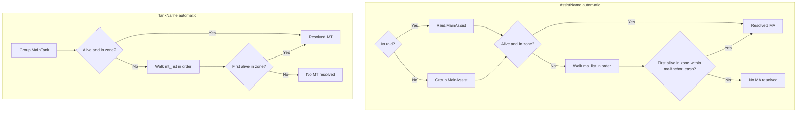

# Automatic MA and MT Selection

This document explains how CZBot resolves **Main Assist (MA)** and **Main Tank (MT)** when `AssistName` or `TankName` is set to **`"automatic"`**. It covers game role sources, **`ma_list`** / **`mt_list`** fallback lists, availability rules, **`maAnchorLeash`**, multi-box editing, and debugging.

For what the MA and MT *do* once resolved (target picking, heals, offtank, puller), see [Tank and Assist Roles](tank-and-assist-roles.md).

---

## Overview

| Setting | Config path | Runtime command |
|---------|-------------|-----------------|
| Main Tank | `settings.TankName` | `/cz tank <name>` or `/cz tank automatic` |
| Main Assist | `settings.AssistName` | `/cz assist <name>` or `/cz assist automatic` |

**Values:**

- **Character name** — Always use that PC.
- **`"automatic"`** — Resolve from EQ group/raid roles, then fallback lists (this document).
- **`"manual"`** — No default; set at runtime with `/cz tank` or `/cz assist`.

**Key points:**

- Resolution is **cached** when `"automatic"`: once MA/MT are resolved, the result is reused until the cached candidate becomes invalid (dies, leaves zone, moves out of `maAnchorLeash` for **ma_list** fallbacks) or an invalidation event occurs. Within each main-loop tick, all callers share one resolved name (no repeated lookups per tick). The Status tab shows the current resolved name with `(auto)` when the setting is `"automatic"`.
- **Cache invalidation** forces a full re-resolve: EQ group/raid Main Assist or Main Tank assignment changes, `ma_list` / `mt_list` edits, `/cz reloadcommon`, zone change, `/cz tank` / `/cz assist`, role preset Apply with setTank/setAssist, or `maAnchorLeash` change.
- **MA and MT resolve independently.** If `AssistName` is unset, it defaults to `TankName` at load, but when both are `"automatic"`, MA still comes from group/raid Main Assist (+ `ma_list`) and MT from group Main Tank (+ `mt_list`). They are not forced to be the same person.
- **`TankName` defaults to `"automatic"`** in new configs. Populate **`ma_list`** and **`mt_list`** in `cz_common.lua` (or the Roles GUI) for reliable multibox fallback.

---

## Resolution cache

When `AssistName` or `TankName` is `"automatic"`, CZBot caches the resolved name and reuses it until invalidated or the candidate fails availability checks.

**Per-tick:** The main loop clears a tick-local memo at the start of each iteration. The first `GetAssistTargetName()` / `GetMainTankName()` call in that tick runs the cache path; subsequent calls (including `AmIMainAssist()` / `AmIMainTank()`) return the same memoized name.

**Persistent cache validity** (cheap checks before a full re-resolve):

1. Raid vs group path unchanged.
2. EQ-assigned primary (Main Assist / Main Tank) unchanged.
3. `ma_list` / `mt_list` generation unchanged (list edits or `/cz reloadcommon`).
4. `maAnchorLeash` generation unchanged.
5. Cached candidate still passes availability for its source (`primary`, `list`, or `primary_retained` for dead MA with no list fallback).

**Invalidation events:** zone change, `/cz tank`, `/cz assist`, role preset Apply (setTank/setAssist), `ma_list`/`mt_list` GUI edits, `/cz reloadcommon`, `/cz maanchorleash`, MA leash edit in Roles GUI. Use `/cz tankrole` for a forced live diagnostic (cache cleared before printing).

---

## Resolution flow



---

## Game role sources (group vs raid)

| Role | Not in raid | In raid |
|------|-------------|---------|
| **MA** | `Group.MainAssist` | `Raid.MainAssist` |
| **MT** | `Group.MainTank` | `Group.MainTank` (group window) |

In a **raid**, the EQ UI has no raid-wide Main Tank or Puller; those always come from the **group** window. CZBot uses **`Group.MainTank`** as the automatic MT primary in both group and raid, then **`mt_list`** when the primary is unavailable.

For **automatic MA resolution** in a raid, CZBot uses **`Raid.MainAssist`** first, then **`ma_list`**.

---

## Primary vs fallback

### Primary (EQ-assigned role)

When the game reports a Main Assist or Main Tank name:

1. Name must be non-empty.
2. Candidate must be **alive** and in the **same zone** as this bot.
3. **No distance check** — a primary who is alive in-zone but far away is still used.

If the primary is dead, feigned, hovering, or in another zone, resolution skips to the fallback list. When no list entry qualifies, the **primary name is still retained** (even if dead) so DPS and nukers can continue on the last assisted target via `lastAssistTargetId`.

### Fallback (`ma_list` / `mt_list`)

When no primary is available:

1. Walk the list **in order** — first eligible name wins.
2. Candidate must be **alive** and in the **same zone**.
3. **`ma_list` only:** candidate must be within **`maAnchorLeash`** of this bot.
4. **`mt_list`:** no leash — healers gate on spell range separately.

**Common gotcha:** If the EQ-assigned MA is alive in your zone but 200 units away, bots still follow that MA. **`ma_list`** entries only matter when the primary fails the alive/in-zone check (or for distance beyond leash). **`mt_list`** applies the same alive/in-zone rules without a leash cap.

---

## Availability criteria

CZBot looks up each candidate via **MQCharInfo** (bot peers) or **Spawn TLO** (non-bot PCs).

| Check | Primary (game role) | `ma_list` fallback | `mt_list` fallback |
|-------|---------------------|--------------------|--------------------|
| Alive | Yes | Yes | Yes |
| Same zone | Yes | Yes | Yes |
| Within `maAnchorLeash` | No | Yes | No |

**Alive (MQCharInfo peer):**

- `State` must not include `DEAD`, `FEIGN`, or `HOVER`.
- `PctHPs` must be `> 0` when known.

**Alive (Spawn fallback for non-bot PCs):**

- Spawn is not dead and not hovering.

**Same zone (tiered lookup for bot peers):**

1. **Early out:** If charinfo reports `peer.Zone.ShortName` and it differs from this bot's zone (case-insensitive), the peer is in another zone — no spawn lookup.
2. **Charinfo distance:** When `Zone.Distance` is non-nil, the peer is in this zone; use charinfo distance/position.
3. **Spawn fallback:** When charinfo distance is nil but zone shortnames match (or charinfo zone name is unknown), check `Spawn('pc =name')` in **this client's instance**. Spawn found → in zone (merged with charinfo alive/target). Spawn absent → other instance or not present locally.
4. **Self:** When the candidate is this bot (`Me.Name`), always in zone with distance 0.

**Same zone (Spawn-only for non-bot PCs):**

- Assumed true when spawn exists in this instance.

---

## `ma_list` and `mt_list`

Stored **top-level** in **`cz_common.lua`** (shared by all bots on that MacroQuest install). At runtime, each bot mirrors them as **`MaList`** and **`MtList`** in runconfig.

**Order = priority.** Put your preferred MA/MT bot first; the first name that passes availability wins.

**Example `cz_common.lua` snippet:**

```lua
ma_list = { "MaBot", "BackupMa" },
mt_list = { "TankBot", "OfftankBot" },
```

There are **no `/cz` add/remove commands** for these lists (unlike exclude, priority, or charm). Edit via the GUI or by hand in `cz_common.lua`.

---

## Editing lists and multi-box sync

**GUI:** `/czshow` → **Roles** tab

- **Main Assist fallback list (`ma_list`)** — ordered PC names.
- **Main Tank fallback list (`mt_list`)** — ordered PC names.
- Add via **Add target** (PC targeted) or **Add** (type name). Reorder with **Up** / **Down**. **Remove** deletes an entry.
- Changes auto-save to `cz_common.lua`.

**After editing on one bot**, run **`/cz reloadcommon`** on every other bot sharing the same `cz_common.lua` so runtime lists match disk.

**Save behavior:**

- **Add** — union-merge with disk (existing entries kept, new names appended).
- **Reorder / remove** — replace list on disk with the current order.

---

## `maAnchorLeash`

**Default chain:** `settings.maAnchorLeash` → `settings.acleash` → `75`

Editable on the Roles tab (**MA leash**). Can also be set at runtime (persists to char config).

**Used for three features:**

1. **`ma_list` fallback** — max distance for MA list candidates (not applied to `mt_list`).
2. **MA camp anchor** — when `maCampAnchor` is on, mob bubble centers on the resolved MA within this distance.
3. **Combat target inject** — when `maCampAnchor` is on, injects the MA's (then MT's) ATTACK target into MobList if the leader is within leash.

`maCampAnchor` is separate from automatic resolution but shares the leash setting. See [Tank and Assist Roles — MA-anchored mob bubble](tank-and-assist-roles.md#ma-anchored-mob-bubble).

---

## Configuration examples

### Typical multibox (group)

```lua
-- Per-char config (each bot)
settings = {
  TankName = "automatic",
  AssistName = "automatic",  -- or omit; defaults to TankName
  maCampAnchor = true,
  acleash = 40,
}
```

```lua
-- cz_common.lua (shared)
ma_list = { "WarriorMa", "MonkBackup" },
mt_list = { "WarriorMa", "SkOfftank" },
```

- Assign **Main Assist** and **Main Tank** in the EQ group window (human or lead bot).
- Lists provide fallback when the assigned role holder dies, zones, or is unavailable.

### Raid

- Set **Raid Main Assist** in the EQ raid window.
- Set **Group Main Tank** in each bot's group window (or rely on **`mt_list`** fallback).
- **`ma_list`** still applies when raid MA is unavailable (with leash). **`mt_list`** applies alive/in-zone only (no leash).

### Legacy: everyone assists the tank

```lua
settings = {
  TankName = "MyTank",
  -- AssistName unset → defaults to "MyTank"
}
```

No automatic resolution or fallback lists involved. Both roles resolve to `MyTank`.

---

## Runtime commands and debugging

| Command / UI | Purpose |
|--------------|---------|
| `/cz tank automatic` | Set MT to automatic for this session (runtime runconfig). |
| `/cz assist automatic` | Set MA to automatic for this session. |
| Status tab | Shows resolved Assist Name and Tank Name; `(auto)` suffix when setting is automatic. |
| `/cz reloadcommon` | Reload `cz_common.lua` and refresh `ma_list` / `mt_list` mirrors. |
| `/cz tankrole` | Print automatic MA/MT resolution details (settings, list candidates, pass/fail per entry, `peerZone` for charinfo debugging). |
| `/cz mobfilter` | Prints MA distance, `inAttack`, target ID, and inject eligibility for the selected spawn. |

`/cz tank` and `/cz assist` with a fixed name override automatic for the session only; char config file is unchanged unless you use `setvar` or edit the file.

---

## Downstream effects

Once MA and MT names are resolved:

- **Healers** target the resolved **MT** (tank phase). See [Healing configuration](healing-configuration.md).
- **DPS** syncs to the resolved **MA** at **assistpct**. See [Tanking configuration](tanking-configuration.md).
- **`AmIMainAssist`** — this bot runs camp target picking (`selectMATarget`). See [Tank and Assist Roles](tank-and-assist-roles.md).
- **`AmIMainTank`** — separate MT follow rules, `mtSticky`, `onlyMT` debuffs. See [Offtank configuration](offtank-configuration.md).
- **Debuff bands** (`matar`, `notmatar`) use resolved MA/MT targets. See [Debuffing configuration](debuffing-configuration.md).

---

## See also

- [Tank and Assist Roles](tank-and-assist-roles.md) — role behavior, mtSticky, puller, offtank
- [Raid mode](raid-mode.md) — raid save/load and raid UI role limits
- [Commands and configuration reference](commands-and-configuration-reference.md) — `/cz tank`, `/cz assist`, `reloadcommon`
- [setvar reference](setvar-reference.md) — `settings.TankName`, `settings.AssistName`, `settings.maCampAnchor`, `settings.maAnchorLeash`
