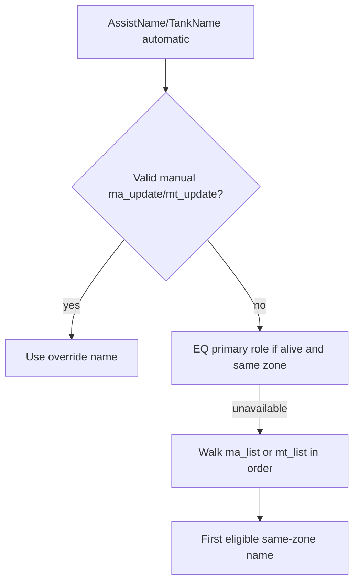

# Automatic MA and MT Selection

This document explains how CZBot resolves **Main Assist (MA)** and **Main Tank (MT)** when `AssistName` or `TankName` is set to **`"automatic"`**. Each bot resolves roles **locally** from EQ group/raid windows and **`ma_list`** / **`mt_list`** (zone-local availability). Optional **`ma_update`** / **`mt_update`** actor messages apply a temporary manual override on peers that stay on `automatic`.

For what the MA and MT *do* once resolved (target picking, heals, offtank, puller), see [Tank and Assist Roles](tank-and-assist-roles.md).

---

## Overview

| Setting | Config path | Runtime command |
|---------|-------------|-----------------|
| Main Tank | `settings.TankName` | `/cz tank set <name>` or `/cz tank automatic` |
| Main Assist | `settings.AssistName` | `/cz assist set <name>` or `/cz assist automatic` |

**Values:**

- **Character name** — Always use that PC.
- **`"automatic"`** — Resolve per rules below (this document).
- **`"manual"`** — No default; set at runtime with `/cz tank set` or `/cz assist set`.

**Key points:**

- Resolution is **cached** per bot when `"automatic"`. No cross-box discovery protocol — every client runs the same logic against its own EQ TLOs and charinfo/spawn data.
- **Manual override:** `/cz assist set <name>` / `/cz tank set <name>` on one box publishes **`ma_update`** / **`mt_update`**. Peers with `automatic` store that name until the PC is unavailable or a newer override arrives. See [CZBot Actor channel](czbot-actor-channel.md).
- **`TankName` defaults to `"automatic"`** in new configs. Populate **`ma_list`** and **`mt_list`** in `cz_common.lua` for fallback priority.
- Logic lives in **`lib/tankrole.lua`** and **`lib/auto_ma_mt.lua`**.

---

## Resolution order



### Game role sources (group vs raid)

| Role | Not in raid | In raid |
|------|-------------|---------|
| **MA** | `Group.MainAssist` | `Raid.MainAssist` |
| **MT** | `Group.MainTank` | *(not used — `mt_list` only)* |

In a **raid**, automatic **MT** ignores `Group.MainTank` and uses **`mt_list` only** (same zone). Automatic **MA** uses **`Raid.MainAssist`** first, then **`ma_list`**. Group-window MA/MT assignments are not used for automatic resolution while in a raid.

### Primary (EQ-assigned role)

When the game reports a Main Assist or Main Tank name:

1. Name must be non-empty.
2. Candidate must be **alive** and in the **same zone** as this bot.
3. **No distance check** for primary — an in-zone primary far away still wins over the list.

If the primary is dead, feigned, hovering, or in another zone, resolution walks the fallback list immediately (no “stuck on corpse name” retention).

### Lists (`ma_list` / `mt_list`)

1. Walk the list **in order** — first eligible name wins.
2. Candidate must be **alive** and in the **same zone**.
3. **`ma_list` (group only):** candidate must be within **`maAnchorLeash`**. In **raid**, `ma_list` is in-zone only (no leash), same as **`mt_list`**.
4. **`mt_list`:** in-zone only; no leash.

Out-of-group backups on the lists are used when the EQ primary is unavailable and they pass availability (including leash for `ma_list` in group).

**Split raid across zones:** Each client only sees PCs in its instance/zone, so bots in zone A and zone B naturally pick different MA/MT from the same ordered lists.

---

## Resolution cache

When `AssistName` or `TankName` is `"automatic"`, CZBot caches the resolved name and reuses it until invalidated or the candidate fails availability checks.

**Per-tick:** The main loop clears a tick-local memo at the start of each iteration. The first `GetAssistTargetName()` / `GetMainTankName()` call in that tick runs the cache path; subsequent calls return the same memoized name.

**Persistent cache validity:** raid vs group path, EQ primary snapshot, list generation, `maAnchorLeash` generation, and whether the cached source (`primary`, `list`, or `manual`) still passes availability.

**Throttled refresh:** Every ~2s, automatic MA/MT are re-resolved so higher-priority roles can reclaim after rez or role changes.

**Invalidation events:** zone change, `/cz tank set`, `/cz assist set`, role preset Apply, `ma_list`/`mt_list` edits, `/cz reloadcommon`, `maAnchorLeash` change. Use `/cz tank status` for a live diagnostic (cache cleared before printing).

---

## Availability criteria

CZBot looks up each candidate via **MQCharInfo** (bot peers) or **Spawn TLO** (non-bot PCs).

| Check | Primary (game role) | `ma_list` fallback | `mt_list` fallback |
|-------|---------------------|--------------------|--------------------|
| Alive | Yes | Yes | Yes |
| Same zone | Yes | Yes | Yes |
| Within `maAnchorLeash` | No | Yes (group only) | No |

See prior sections in this doc for charinfo vs spawn tiering (same as before).

---

## `ma_list` and `mt_list`

Stored **top-level** in **`cz_common.lua`**. At runtime, each bot mirrors them as **`MaList`** and **`MtList`** in runconfig.

**Order = priority.** Put your preferred MA/MT bot first; the first name that passes availability wins.

```lua
ma_list = { "MaBot", "BackupMa" },
mt_list = { "TankBot", "OfftankBot" },
```

Edit via `/czshow` → **Roles** tab or by hand in `cz_common.lua`. After editing on one bot, run **`/cz reloadcommon`** on others sharing the same `cz_common.lua`.

---

## `maAnchorLeash`

**Default chain:** `settings.maAnchorLeash` → `settings.acleash` → `75`

Used for **`ma_list` fallback in group**, MA camp anchor, and combat target inject (when `maCampAnchor` is on). Not applied to `mt_list` or to `ma_list` in raid.

---

## Configuration examples

### Typical multibox (group)

Assign **Main Assist** and **Main Tank** in the EQ group window; lists provide fallback when the assigned holder dies or is out of range (MA list) / out of zone.

### Raid

Set **Raid Main Assist** in the EQ raid window. Maintain **`mt_list`** for heal priority — automatic MT does **not** use group Main Tank in raid. **`ma_list`** applies when raid MA is unavailable (in-zone only).

---

## Runtime commands and debugging

| Command / UI | Purpose |
|--------------|---------|
| `/cz tank automatic` / `/cz assist automatic` | Persist automatic mode. |
| `/cz tank set <name>` / `/cz assist set <name>` | Fixed name (persisted); broadcasts `mt_update` / `ma_update`. |
| `/cz tank status` / `/cz tankrole` | Resolution path, list audit, top candidates. |
| `/cz reloadcommon` | Reload shared lists from `cz_common.lua`. |

---

## See also

- [Tank and Assist Roles](tank-and-assist-roles.md)
- [Raid mode](raid-mode.md)
- [CZBot Actor channel](czbot-actor-channel.md) — `ma_update`, `mt_update`, `ma_engaged`
- [CH chain configuration](chchain-configuration.md) — `mt_list` and curtank sync
