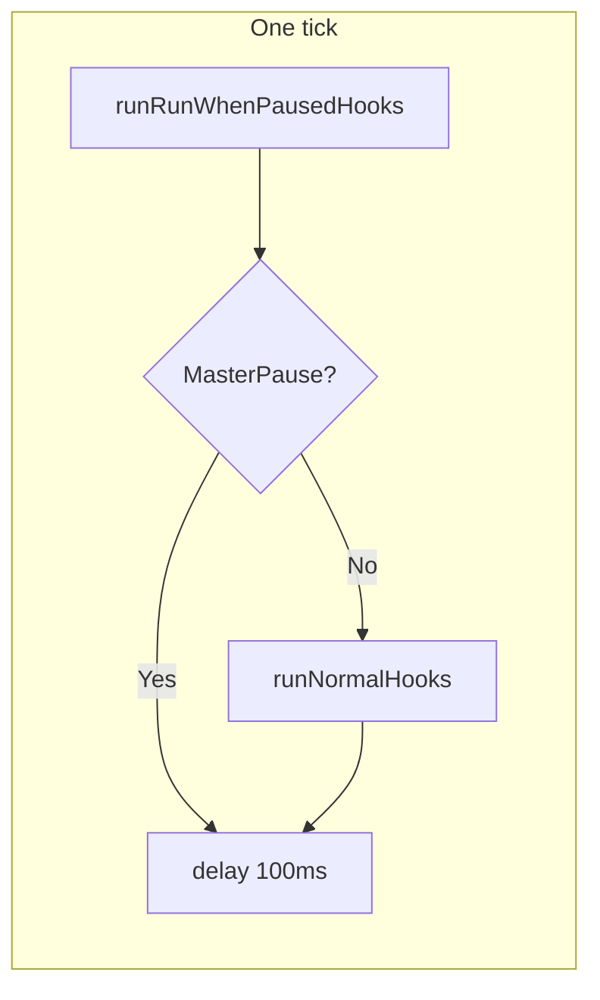

# Bot Logic: State and Flow

This section charts the bot's state and decision logic so you can trace how any action is chosen and executed. The main loop lives in `botlogic.lua` (`mainloop()`): it runs until `state.getRunconfig().terminate` is true; each iteration runs hooks then `mq.delay(100)`.

## Requirements

MQ2Cast, MQ2MoveUtils, and MQ2Twist are required. The bot relies on MQ2Cast to handle spell casting and to memorize spells into gems when needed as part of the `/casting` command; the script does not manage memorization itself. They are loaded in `init.lua` before the main loop runs; the bot does not start if any fail to load. Spell casting flow and event docs assume MQ2Cast is present.

## One-tick flow

Every tick the loop does the following:

- **runRunWhenPausedHooks()** — Always runs. Executes every hook that was registered with `runWhenPaused = true` (e.g. network sync). Currently no hooks use this.
- **runNormalHooks()** — Runs only when `MasterPause` is not set. Its behavior depends on `runState` and the current payload.

### When runState is `dead`

The character is DEAD or HOVER. Only hooks with **runWhenDead = true** run:

- doEvents (process MQ events)
- charState (hover timer, consent, etc.)

See [Run state machine](run-state-machine.md) for how the bot enters and leaves the dead state.

### When runState is busy

When `runState` is one of the **busy** states, only hooks whose **priority is less than or equal to** `payload.priority` run. That keeps the "owner" of the current activity (e.g. doPull, or the spell hook that set `casting`) and higher-priority hooks in the loop; lower-priority hooks are skipped until the activity finishes.

Busy states (from `lib/state.lua`):

| State | Set by |
|-------|--------|
| pulling | doPull |
| raid_mechanic | doRaid |
| casting | spellutils (heal/buff/debuff/cure) |
| dragging | botmove (DragCheck) |
| camp_return | botmove (MakeCamp return) |
| engage_return_follow | botmove (MT return to follow) |
| unstuck | botmove (UnStuck) |
| chchain | chchain (Complete Heal chain) |

Details: [Run state machine](run-state-machine.md).

### Otherwise (idle or non-busy)

All normal hooks run in **priority order** (lowest number first).

---

## Hook order and deep-dives

Hooks are defined in `lib/bothooks.lua`. Execution order:

| Priority | Hook | Description | Deep-dive |
|----------|------|-------------|-----------|
| 100 | zoneCheck | Detect zone change; call OnZoneChange if needed | [hook-zonecheck](hook-zonecheck.md) |
| 200 | doEvents | Process MQ events (`mq.doevents()`) | [hook-doevents](hook-doevents.md) |
| 300 | charState | Character state: dead/hover, camp, sit, follow, loot, mount, pet, combat clear | [hook-charstate](hook-charstate.md) |
| 350 | doRaid | Raid mechanics; sets raid_mechanic when active | [hook-doraid](hook-doraid.md) |
| 400 | AddSpawnCheck | Build camp mob list (MobList, MobCount) | [hook-addspawncheck](hook-addspawncheck.md) |
| 500 | chchainTick | Complete Heal chain tick | [hook-chchain](hook-chchain.md) |
| 600 | doMelee | Tank/MA/offtank/DPS target selection and engage | [hook-domelee](hook-domelee.md) |
| 700 | priorityCure | Cure check (priority phase only) | [hook-prioritycure](hook-prioritycure.md) |
| 800 | doPull | Pull state machine: navigate, aggro, return | [hook-dopull](hook-dopull.md) |
| 900 | doHeal | Heal phase-first spell check | [hook-doheal](hook-doheal.md) |
| 1000 | doDebuff | Debuff phase-first spell check | [hook-dodebuff](hook-dodebuff.md) |
| 1100 | doBuff | Buff phase-first spell check | [hook-dobuff](hook-dobuff.md) |
| 1200 | doCure | Cure phase-first spell check | [hook-docure](hook-docure.md) |
| 1400 | doMiscTimer | Throttled 1s: drag, follow, stuck, camp leash | [hook-domisctimer](hook-domisctimer.md) |

---

## See also

- [Run state machine](run-state-machine.md) — All runStates, who sets them, and how they filter hooks
- [Events](events.md) — MQ events and handlers (zone, slain, FTE, GM, etc.)
- [Main loop and hook order](main-loop-and-hooks.md) — Exact filtering logic and hook table
- [Spell casting flow](spell-casting-flow.md) — How heal/buff/debuff/cure decide and cast (RunPhaseFirstSpellCheck, CastSpell)
- [Movement and misc state](movement-and-misc.md) — Pull, unstuck, dragging, camp return, engage-return-follow
