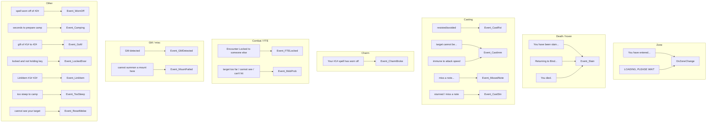

# Events (MQ events and zone)

The bot subscribes to MQ (game) events in `botevents.BindEvents()`. Handlers run when `mq.doevents()` is called from the **doEvents** hook. This page charts which events exist and how they update state or runconfig.

## Event → handler overview

Additional events are registered by **chchain** and **follow** in their own `registerEvents()` (e.g. CHChain Go, stop, start, tank, pause).

---

## OnZoneChange (and DelayOnZone)

Used by the **zoneCheck** hook (when `zonename != Zone.ShortName()`) and by MQ zone events ("You have entered", "LOADING, PLEASE WAIT").

1. Sets `statusMessage = 'Zone change, waiting...'`, delay 1s.
2. **DelayOnZone()**:
   - If runState is `dead`, clears run state.
   - Sets `zonename` to current zone short name.
   - Clears camp: `makecamp` and `campstatus = false`.
   - Turns off `dopull`; clears `engageTargetId` and global `APTarget`.
   - Runs mobfilter for exclude and priority (zone).
   - Cleans spellstates mob list; resets `MountCastFailed`.
3. Clears `statusMessage`.

See [Run state machine](run-state-machine.md) and [hook AddSpawnCheck](hook-addspawncheck.md) (MobList is rebuilt each tick from current zone/camp).

---

## Event_Slain

Runs when the character is slain or "Returning to Bind Location" or "You died." (hover).

- Prints remaining hover time; runs `/consent group`, `/consent raid`, `/consent guild`.
- Sets `HoverTimer = mq.gettime() + 30000` so CharState can throttle calling Event_Slain again.

CharState sets `runState = 'dead'` when DEAD/HOVER and sets `HoverEchoTimer`; when `HoverTimer` has passed it calls `Event_Slain()`.

---

## Event_FTELocked

Target is Encounter Locked (FTE) to someone else.

- Echoes message; increments `FTECount` if it was 0.
- Updates `FTEList[spawn.ID()]` with hitcount (1→2→3) and timer (10s, 30s, 90.5s).
- Runs: `/target myself`, `/attack off`, `/stopcast`, `/nav stop`, `/stick off`.
- If `dopull` is true: clears pull target (sets global `APTarget = false`).

Pull and AddSpawnCheck use FTE list to avoid pulling or listing FTE-locked mobs.

---

## Event_GMDetected

Called when GM check (e.g. MQ2GMCheck) indicates a GM is present. Throttled by `gmtimer` (60s).

- Disables domelee; `/stick off`; clears `makecamp` and `CampStatus`; sets `gmtimer` so the handler won’t fire again for 60s.

---

## Event_CastRst / Event_CastImm

- **CastRst** (resist/avoid): sets global `SpellResisted = true`. Debuff and other logic can use this on cast complete (e.g. recast counter, immune list).
- **CastImm** (target cannot be / immune to slow): if the current cast matches `CurSpell` and target is single-target, calls `immune.processList(immuneID)` for the target so the bot can avoid recasting that spell on that mob.

---

## Other handlers (short notes)

| Event | Handler | Effect |
|-------|---------|--------|
| MissedNote | Event_MissedNote | Sets `runconfig.MissedNote = true` |
| CastStn | Event_CastStn | Stub (no-op) |
| CharmBroke | Event_CharmBroke | `charm.OnCharmBroke(line, charmspell)` |
| ResetMelee | Event_ResetMelee | Stub |
| WornOff | Event_WornOff | Stub |
| Camping | Event_Camping | Stub |
| GoM | Event_GoM | Stub |
| LockedDoor | Event_LockedDoor | Stub |
| LinkItem | Event_LinkItem | Validates slot/HP filter; echoes item link and /rs |
| TooSteep | Event_TooSteep | Stub |
| MountFailed | Event_MountFailed | If domount: sets global `MountCastFailed = true` |
| MobProb | Event_MobProb | Throttled 3s; if engageTargetId and path length ≤ acleash, /nav to target; sets mobprobtimer |

---

## Reference

- All event registrations: `botevents.lua` → `BindEvents()`.
- doEvents hook: [hook-doevents](hook-doevents.md).
- Zone detection: [hook-zonecheck](hook-zonecheck.md).
