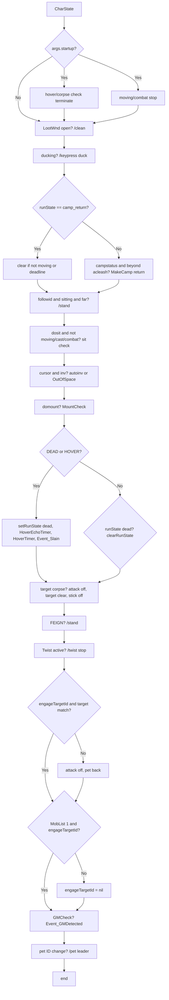

# Hook: charState

**Priority:** 300  
**Provider:** Built-in (botlogic.lua)  
**runWhenDead:** true

## Logic

CharState runs a long sequence of per-tick checks. Order of operations:

- **Startup:** On first run with arg `startup`: if hovering/corpse, set terminate; stop nav/stick; if combat, attack off.
- **Camp return:** If runState is camp_return and (not moving or deadline passed), clearRunState. If campstatus and beyond acleash, call botmove.MakeCamp('return').
- **Sit:** If dosit, not moving, no cast, no combat, no autofire: if follow and far skip sit; else if mana/endur in band (and not 40% HP with mobs) then /sit on.
- **Dead:** If DEAD or HOVER, set runState 'dead', set HoverEchoTimer if unset, and if HoverTimer passed call Event_Slain. If we were dead and are now alive, clearRunState.
- **Engage:** If we have no engageTargetId or our target is not engageTargetId, attack off and pet back. If no MobList[1] and engageTargetId, clear engageTargetId.
- **Pet:** If pet ID changed (new pet or different), set MyPetID and /pet leader.

## See also

- [README](README.md)
- [Run state machine](run-state-machine.md) — dead, camp_return
- [Events](events.md) — Event_Slain, Event_GMDetected
- [Movement and misc state](movement-and-misc.md) — MakeCamp return
