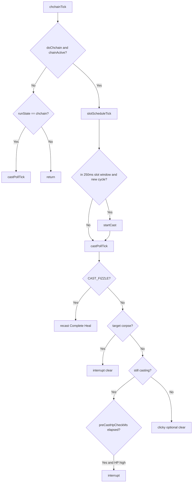

# Hook: chchainTick

**Priority:** 500  
**Provider:** lib.chchain

## Logic

Runs whenever **`doChchain` and `chainActive`** (not only while casting). Each bot schedules its own Complete Heal from a shared start clock — no baton messages. Casts use **`lib.casting`** (`/cast` gem).

**Start/kickoff:** czactor `chchain_control` → `beginSchedule` (`chainStart = now + startCountdownMs`, refresh slot). Slot 1 fires first after countdown; others at `(slot-1) * delayMs` into each cycle.

## See also

- [CHChain configuration](../chchain-configuration.md)
- [Spell casting flow](spell-casting-flow.md)
- [README](README.md)
