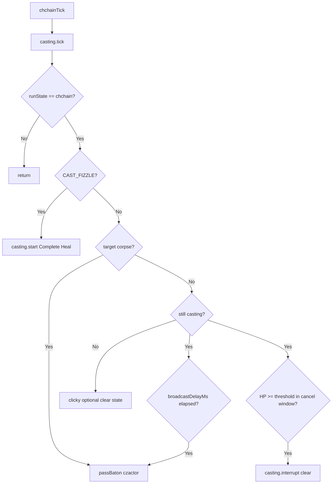

# Hook: chchainTick

**Priority:** 500  
**Provider:** lib.chchain

## Logic

Runs when runState is **chchain**. Cast is started by **`chchain_baton`** on the czactor channel (or local kickoff) via **`lib.casting`** (`/cast` gem), not MQ2Cast. The tick calls `casting.tick()`, then polls the cast: baton at delay, cancel window, fizzle/corpse handling.

**OnBaton:** czactor `chchain_baton` for this cleric → target first alive in-range tank from `mt_list` → `casting.start` Complete Heal → set runState with tank name and cast start time.

## See also

- [CHChain configuration](../chchain-configuration.md)
- [Spell casting flow](spell-casting-flow.md)
- [README](README.md)
