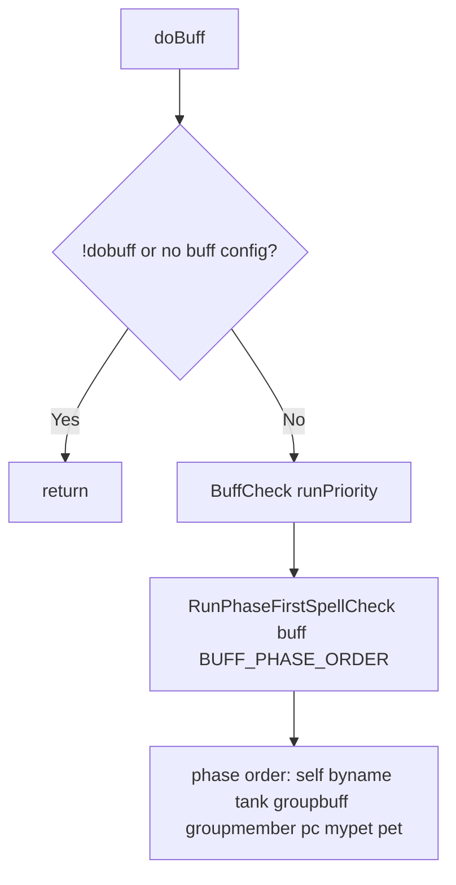

# Hook: doBuff

**Priority:** 1100  
**Provider:** botbuff

## Logic

Runs the phase-first spell check for the **buff** section. Phase order: self, byname, tank, groupbuff, groupmember, pc, mypet, pet.

BuffCheck calls RunPhaseFirstSpellCheck with buff-specific getTargetsForPhase and targetNeedsSpell. Bands control which phases each spell uses (self, tank, groupbuff, validtargets, mypet, pet, petspell). IconCheck and PeerHasBuff / Stacks / FreeBuffSlots determine if a target needs the spell. Spell completion and interrupt (including MQ2Cast) are described in [Spell casting flow](spell-casting-flow.md).

## See also

- [README](README.md)
- [Spell casting flow](spell-casting-flow.md)
- [Buffing configuration](../buffing-configuration.md)
- [Spell targeting and bands](../spell-targeting-and-bands.md)
