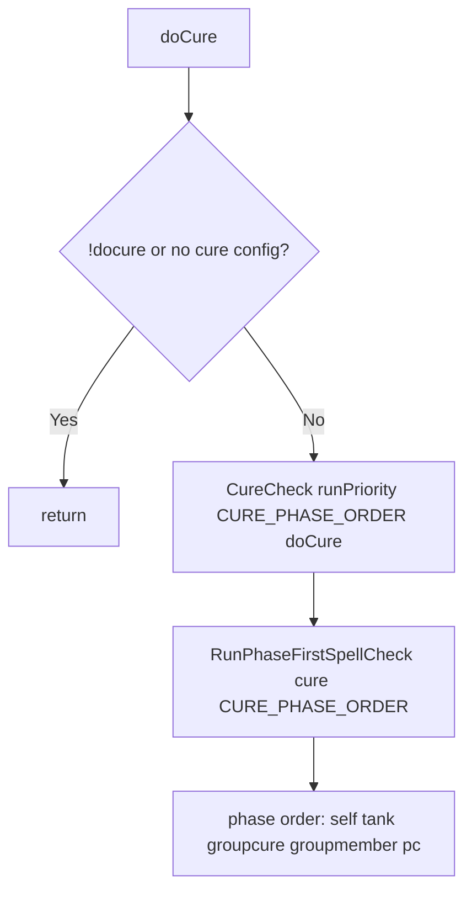

# Hook: doCure

**Priority:** 1200  
**Provider:** botcure

## Logic

Runs the phase-first spell check for the **cure** section. Phase order: self, tank, groupcure, groupmember, pc.

CureEvalForTarget checks cure type (poison, disease, curse, corruption, all) against self or peer detrimentals; DistanceCheck and band (tank, groupmember, class) apply. Groupcure uses an AE count check (needCure per member). Spells have curetype and bands (self, tank, groupcure, groupmember, class). See [Spell casting flow](spell-casting-flow.md). priorityCure uses the same pipeline with phase order { 'priority' } only.

## See also

- [README](README.md)
- [Spell casting flow](spell-casting-flow.md)
- [hook-prioritycure](hook-prioritycure.md)
- [Curing configuration](../curing-configuration.md)
- [Spell targeting and bands](../spell-targeting-and-bands.md)
