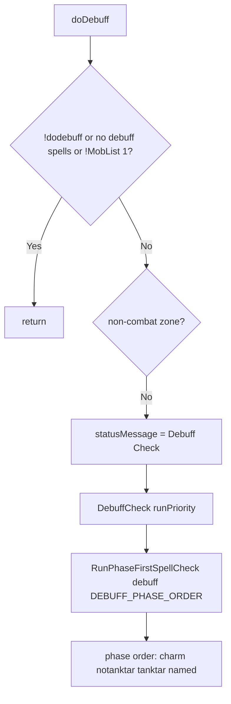

# Hook: doDebuff

**Priority:** 1000  
**Provider:** botdebuff

## Logic

Runs the phase-first spell check for the **debuff** section. Phase order: charm, notanktar, tanktar, named. Charm recasts and charm targeting are evaluated first; then non-tank adds, then tank target, then named tank target.

DebuffEval (per spell index): charm recast request → charm.EvalTarget → DebuffEvalTankTar → DebuffEvalNotanktar → DebuffEvalNamedTankTar. Bands control tanktar, notanktar, named, mobMin/mobMax. BeforeCast: recast check; for tanktar set engageTargetId (if not offtank) and pet attack. afterCast can increment resist counter and disable spell for spawn after N resists. Spell completion and interrupt (including MQ2Cast) are described in [Spell casting flow](spell-casting-flow.md); see charm module for charm-specific logic.

## See also

- [README](README.md)
- [Spell casting flow](spell-casting-flow.md)
- [Debuffing configuration](../debuffing-configuration.md)
- [Spell targeting and bands](../spell-targeting-and-bands.md)
