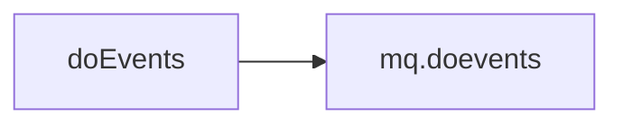

# Hook: doEvents

**Priority:** 200  
**Provider:** Built-in (botlogic.lua)  
**runWhenDead:** true

## Logic

The hook simply calls **mq.doevents()**, which processes the MQ event queue. All game events registered in botevents.BindEvents() (and chchain/follow) are dispatched from here. Because doEvents has **runWhenDead = true**, it still runs when the character is DEAD or HOVER so that zone, slain, and other events continue to be processed.

## See also

- [README](README.md)
- [Events](events.md)
