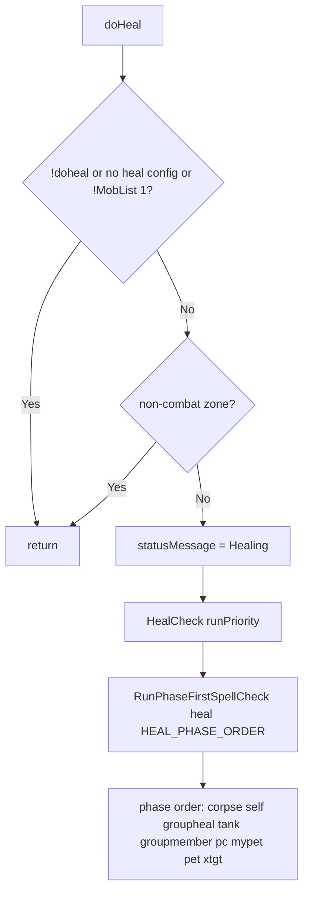

# Hook: doHeal

**Priority:** 900  
**Provider:** botheal

## Logic

Runs the phase-first spell check for the **heal** section. Phase order: corpse, self, groupheal, tank, groupmember, pc, mypet, pet, xtgt.

HealCheck builds context (tank, bots, spell ranges, etc.) and calls spellutils.RunPhaseFirstSpellCheck with heal-specific getTargetsForPhase, getSpellIndicesForPhase, and targetNeedsSpell (HP bands, corpse rez filters, group/xt). Each phase returns targets (e.g. corpse IDs, self, tank, group members); spells that have that phase in their bands are tried in order; first valid (beforeCast, immuneCheck, PreCondCheck) triggers CastSpell. See [Spell casting flow](spell-casting-flow.md).

## See also

- [README](README.md)
- [Spell casting flow](spell-casting-flow.md)
- [Healing configuration](../healing-configuration.md)
- [Spell targeting and bands](../spell-targeting-and-bands.md)
