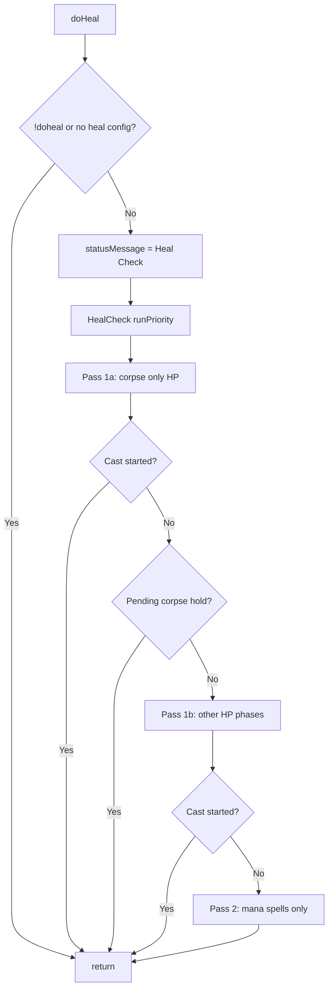

# Hook: doHeal

**Priority:** 900  
**Provider:** botheal

## Logic

Runs the phase-first spell check for the **heal** section in two resource passes. **Pass 1 (HP)** runs **corpse first** in its own sub-pass, then remaining HP phases (self, groupheal, tank, offtank, groupmember, pc, mypet, pet, xtgt). **Pass 2 (Mana)** runs the non-corpse phases only.

```mermaid
flowchart TB
    Start[doHeal] --> Guards{!doheal or no heal config?}
    Guards -->|Yes| End[return]
    Guards -->|No| Status[statusMessage = Heal Check]
    Status --> HealCheck[HealCheck runPriority]
    HealCheck --> CorpsePass[Pass 1a: corpse only HP]
    CorpsePass --> CorpseCast{Cast started?}
    CorpseCast -->|Yes| End
    CorpseCast -->|No| CorpseHold{Pending corpse hold?}
    CorpseHold -->|Yes| End
    CorpseHold -->|No| HpPass[Pass 1b: other HP phases]
    HpPass --> HpCast{Cast started?}
    HpCast -->|Yes| End
    HpCast -->|No| ManaPass[Pass 2: mana spells only]
    ManaPass --> End
```

HealCheck builds context (tank, bots, spell ranges, etc.) and calls `RunPhaseFirstSpellCheck` up to three times when needed:

1. **HP corpse pass** — only the **corpse** phase with HP spells (rez).
2. **HP hold** — if eligible corpses remain and rez is not intentionally combat-deferred, the heal hook returns without running other HP phases (retries corpse next tick).
3. **HP pass** — remaining phases (self through xtgt) with HP spells.
4. **Mana pass** — same non-corpse phases with **healResource** `'mana'` spells (e.g. cannibalize); runs only if prior passes did not start a cast.

When corpses are pending and a heal resume cursor points at a later phase, the resume is cleared so corpse is re-evaluated. Each pass uses heal-specific `getTargetsForPhase`, filtered `getSpellIndicesForPhase`, and `targetNeedsSpell` (HP bands, corpse rez filters, group/xt). Each phase returns targets (e.g. corpse IDs, self, tank, group members); spells that have that phase in their bands are tried in order; first valid (beforeCast, immuneCheck, PreCondCheck) triggers CastSpell. Resume after a cast continues the pass matching the stored spell's resource type. Spell completion and interrupt (including MQ2Cast) are described in [Spell casting flow](spell-casting-flow.md).

## See also

- [README](README.md)
- [Spell casting flow](spell-casting-flow.md)
- [Healing configuration](../healing-configuration.md)
- [Spell targeting and bands](../spell-targeting-and-bands.md)
