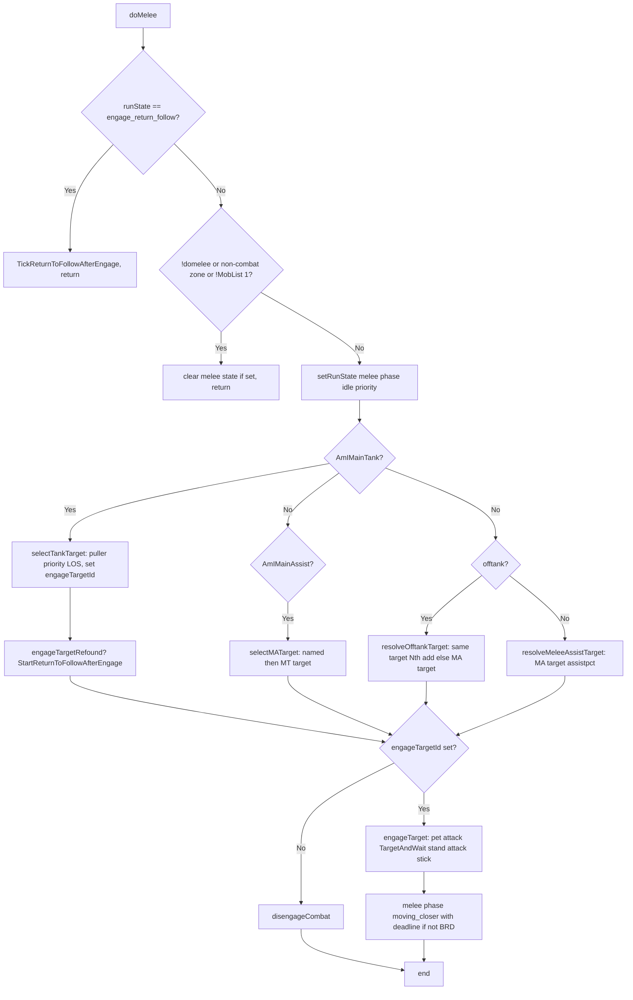

# Hook: doMelee

**Priority:** 600  
**Provider:** botmelee

## Logic

DoMelee resolves who to engage (MT, MA, offtank, or DPS) and then either engages that target or disengages. When runState is **engage_return_follow**, it only runs botmove.TickReturnToFollowAfterEngage and returns.

- **MT (selectTankTarget):** Only if I am group MT. Pick closest LOS mob from MobList; prefer puller's target, then current engageTargetId, then closest. Set engageTargetId; if we refound the same engage target, call StartReturnToFollowAfterEngage.
- **MA (selectMATarget):** Pick from MobList: first named in LOS, else MT's target. Set engageTargetId.
- **Offtank (resolveOfftankTarget):** If MT and MA same target, pick Nth add (not that target) from MobList, else set engageTargetId to MA target. If same target and MA target HP <= assistpct, can use MA target.
- **DPS (resolveMeleeAssistTarget):** Sync to MA target when MA is engaging (MA target HP <= assistpct). Clear engageTargetId if MA has no target; else set from MobList when MA target in list and HP in range.
- **engageTarget:** If melee phase is moving_closer and in melee range or deadline, set phase idle and return. Pet attack engageTargetId if petassist. TargetAndWait, stand, attack on, stick. Set melee state with phase moving_closer and 5s deadline (non-BRD).
- **disengageCombat:** statusMessage clear, ResetCombatState (stick off, attack off, pet back, target clear).

Non-MT/MA: minmana gate — only run AdvCombat if minmana is 0 or current mana above minmana.

## See also

- [README](README.md)
- [Run state machine](run-state-machine.md) — melee, engage_return_follow
- [Tank and assist roles](../tank-and-assist-roles.md)
- [Offtank configuration](../offtank-configuration.md)
- [Movement and misc state](movement-and-misc.md) — engage return follow
- [hook-addspawncheck](hook-addspawncheck.md) — MobList source
