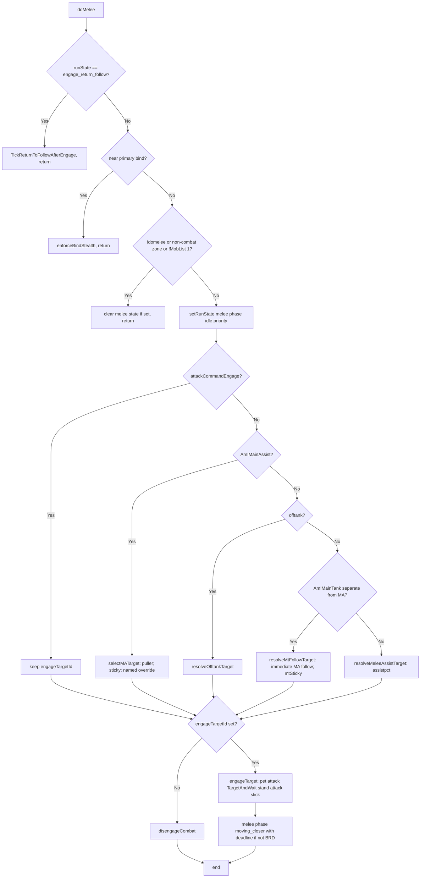

# Hook: doMelee

**Priority:** 600  
**Provider:** botmelee

## Logic

DoMelee resolves who to engage (MA picker, separate MT follower, offtank, or DPS) and then either engages that target or disengages. When runState is **engage_return_follow**, it only runs botmove.TickReturnToFollowAfterEngage and returns.

```mermaid
flowchart TB
    Start[doMelee] --> EngageReturn{runState == engage_return_follow?}
    EngageReturn -->|Yes| TickReturn[TickReturnToFollowAfterEngage, return]
    EngageReturn -->|No| Bind{near primary bind?}
    Bind -->|Yes| ClearBind[enforceBindStealth, return]
    Bind -->|No| Guards{!domelee or non-combat zone or !MobList 1?}
    Guards -->|Yes| ClearMelee[clear melee state if set, return]
    Guards -->|No| SetMelee[setRunState melee phase idle priority]
    SetMelee --> AttackLock{attackCommandEngage?}
    AttackLock -->|Yes| KeepEngage[keep engageTargetId]
    AttackLock -->|No| MA{AmIMainAssist?}
    MA -->|Yes| MATarget[selectMATarget: puller; sticky; named override]
    MA -->|No| OT{offtank?}
    OT -->|Yes| OTResolve[resolveOfftankTarget]
    OT -->|No| MT{AmIMainTank separate from MA?}
    MT -->|Yes| MTFollow[resolveMtFollowTarget: immediate MA follow; mtSticky]
    MT -->|No| DPS[resolveMeleeAssistTarget: assistpct]
    KeepEngage --> HasTarget
    MATarget --> HasTarget
    OTResolve --> HasTarget
    MTFollow --> HasTarget
    DPS --> HasTarget
    HasTarget{engageTargetId set?}
    HasTarget -->|Yes| Engage[engageTarget: pet attack TargetAndWait stand attack stick]
    HasTarget -->|No| Disengage[disengageCombat]
    Engage --> MeleePhase[melee phase moving_closer with deadline if not BRD]
    Disengage --> End[end]
    MeleePhase --> End
```

- **MA (selectMATarget):** Only effective MA bot. Named-first initial pick; puller priority; sticky engage with named mid-fight override. **`mtSticky` ignored** when same bot is MT. When **Leash to radius** is on (`doCampAcleash`), sticky/combat picks and `isEngageableMobListSpawn` require the spawn within **acleash** of the camp pin (`isSpawnWithinCampPin`). `doMelee` disengages when the player leaves that radius.
- **Separate MT (resolveMtFollowTarget):** Follow MA immediately (no assistpct). **`mtSticky`:** keep `engageTargetId` once set (within camp pin when leash on); otherwise switch with MA.
- **Offtank (resolveOfftankTarget):** If MT and MA same target, pick Nth add; else MA target. Sticks on engaged add or MA off-target until it dies (no assistpct fallback to main mob).
- **DPS (resolveMeleeAssistTarget):** Sync to MA at **assistpct**.
- **engageTarget / disengageCombat:** unchanged — see prior doc.

Non-MT/MA: minmana gate — only run AdvCombat if minmana is 0 or current mana above minmana.

## See also

- [README](README.md)
- [Tank and assist roles](../tank-and-assist-roles.md)
- [Offtank configuration](../offtank-configuration.md)
- [hook-addspawncheck](hook-addspawncheck.md) — MobList source
