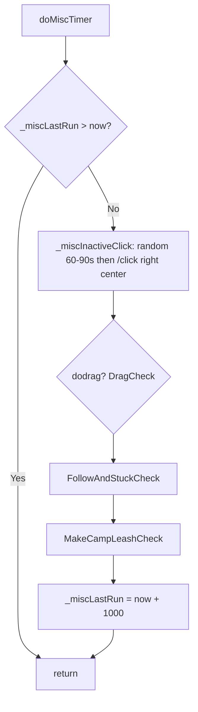

# Hook: doMiscTimer

**Priority:** 1400  
**Provider:** Built-in (botlogic.lua)

## Logic

Runs once per second (throttled by _miscLastRun). Runs inactive click (random 60–90s), drag check, follow/stuck check, and camp leash check.

- **Inactive click:** Only when no engageTargetId; throttle 60–90s random then /click right center.
- **DragCheck:** See [Movement and misc state](movement-and-misc.md#dragging-domisctimer--dragcheck). tickSumcorpsePending; if runState dragging then tickDragging; else findCorpseToDrag and startDrag.
- **FollowAndStuckCheck:** TickReturnToFollowAfterEngage (engage_return_follow phases). Refresh followid; if shouldCallFollow (followid, distance >= followdistance, no engage) then FollowCall (UnStuck if stucktimer passed, stand, /nav to followid). Update stucktimer when within leash.
- **MakeCampLeashCheck:** If campstatus and no engageTargetId and not casting (non-BRD): if over leash (distance or LOS), doLeashResetCombat and MakeCamp('return').

UnStuck (called from FollowCall) sets runState **unstuck** with phases nav_wait5, wiggle_wait, back_wait. StartDrag sets **dragging** (init → sneak → navigating). MakeCamp('return') sets **camp_return**. StartReturnToFollowAfterEngage (from doMelee) sets **engage_return_follow**; TickReturnToFollowAfterEngage clears it when nav done or deadline.

## See also

- [README](README.md)
- [Run state machine](run-state-machine.md)
- [Movement and misc state](movement-and-misc.md)
- [hook-domelee](hook-domelee.md) — StartReturnToFollowAfterEngage, TickReturnToFollowAfterEngage
- [Corpse dragging](../corpse-dragging.md)
