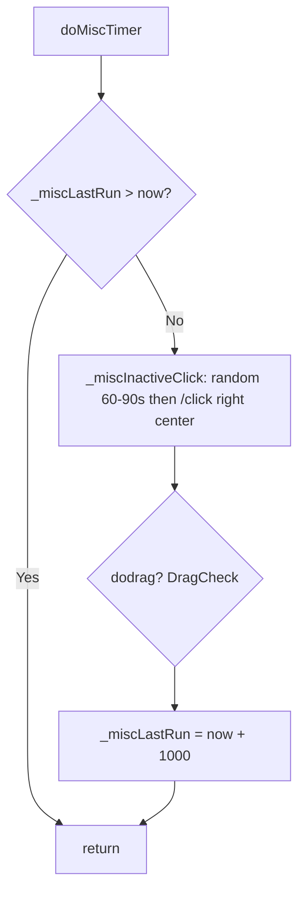

# Hook: doMiscTimer

**Priority:** 1400  
**Provider:** Built-in (botlogic.lua)

## Logic

Runs once per second (throttled by _miscLastRun). Runs **inactive click** (random 60–90s) and **DragCheck** only. Follow/stuck check and camp leash check are handled by **doMovementCheck** (runWhenBusy); see [Movement and misc state](movement-and-misc.md).

- **Inactive click:** Only when no engageTargetId; throttle 60–90s random then /click right center.
- **DragCheck:** See [Movement and misc state](movement-and-misc.md#dragging-domisctimer--dragcheck). tickSumcorpsePending; if runState dragging then tickDragging; else findCorpseToDrag and startDrag.

StartDrag sets runState **dragging** (init → sneak → navigating). FollowAndStuckCheck and MakeCampLeashCheck are run by **doMovementCheck** (priority 1350, runWhenBusy), so camp return and follow/stuck logic run even when the bot is busy (e.g. casting).

## See also

- [README](README.md)
- [Run state machine](run-state-machine.md)
- [Movement and misc state](movement-and-misc.md)
- [hook-domelee](hook-domelee.md) — StartReturnToFollowAfterEngage, TickReturnToFollowAfterEngage
- [Corpse dragging](../corpse-dragging.md)
