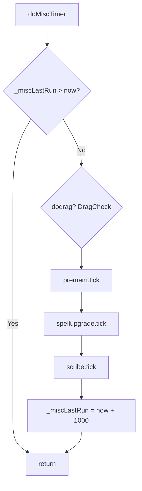

# Hook: doMiscTimer

**Priority:** 1400  
**Provider:** Built-in (botlogic.lua)

## Logic

Runs once per second (throttled by _miscLastRun). Runs **DragCheck**, **premem**, **spellupgrade**, and **scribe** ticks. Follow/stuck check and camp leash check are handled by **doMovementCheck** (runWhenBusy); see [Movement and misc state](movement-and-misc.md).

Anti-AFK (random sit/stand or micro-nudge after 3–4 min continuous idle) lives in [`lib/antiafk.lua`](../../lib/antiafk.lua) and runs every main-loop tick via `antiafk.tick()` — including when `MasterPause` is on — when **`settings.antiAfk`** is on (default). Toggle via Status tab flag, **`/cz antiafk`**, or setvar.

```mermaid
flowchart TB
    Start[doMiscTimer] --> Throttle{_miscLastRun > now?}
    Throttle -->|Yes| End[return]
    Throttle -->|No| Drag{dodrag? DragCheck}
    Drag --> Premem[premem.tick]
    Premem --> Upgrade[spellupgrade.tick]
    Upgrade --> Scribe[scribe.tick]
    Scribe --> SetLast[_miscLastRun = now + 1000]
    SetLast --> End
```

- **DragCheck:** See [Movement and misc state](movement-and-misc.md#dragging-domisctimer--dragcheck). tickSumcorpsePending; if runState dragging then tickDragging; else findCorpseToDrag and startDrag.

StartDrag sets runState **dragging** (init → sneak → navigating). FollowAndStuckCheck and MakeCampLeashCheck are run by **doMovementCheck** (priority 1350, runWhenBusy), so camp return and follow/stuck logic run even when the bot is busy (e.g. casting).

## See also

- [README](README.md)
- [Run state machine](run-state-machine.md)
- [Movement and misc state](movement-and-misc.md)
- [hook-domelee](hook-domelee.md) — StartReturnToFollowAfterEngage, TickReturnToFollowAfterEngage
- [Corpse dragging](../corpse-dragging.md)
