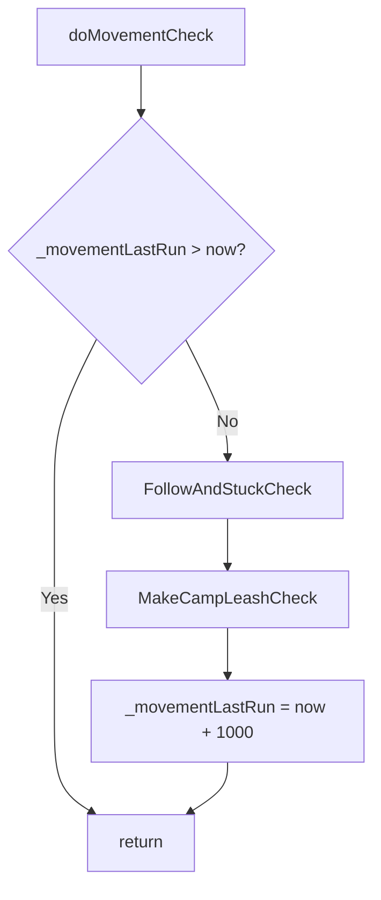

# Hook: doMovementCheck

**Priority:** 1350  
**Provider:** Built-in (botlogic.lua)  
**runWhenBusy:** true

## Logic

Runs when the bot is busy (e.g. casting) in a second pass after the priority loop, so camp return and follow/stuck logic still run. Throttled to once per second. Runs **FollowAndStuckCheck** and **MakeCampLeashCheck** only.

- **FollowAndStuckCheck:** TickReturnToFollowAfterEngage (engage_return_follow phases). Refresh followid; if shouldCallFollow (followid, distance >= followdistance, no engage) then FollowCall (UnStuck if stucktimer passed, stand, /nav to followid). Update stucktimer when within leash.
- **MakeCampLeashCheck:** If campstatus and no engageTargetId and not casting (non-BRD): if over leash (distance or LOS), doLeashResetCombat and MakeCamp('return').

UnStuck (called from FollowCall) sets runState **unstuck** with phases nav_wait5, wiggle_wait, back_wait. MakeCamp('return') sets **camp_return**. StartReturnToFollowAfterEngage (from doMelee) sets **engage_return_follow**; TickReturnToFollowAfterEngage clears it when nav done or deadline.

## See also

- [README](README.md)
- [Run state machine](run-state-machine.md)
- [Movement and misc state](movement-and-misc.md) — Unstuck, camp return, engage-return-follow
- [hook-domelee](hook-domelee.md) — StartReturnToFollowAfterEngage, TickReturnToFollowAfterEngage
- [hook-domisctimer](hook-domisctimer.md) — DragCheck (doMiscTimer does not run follow/camp)
