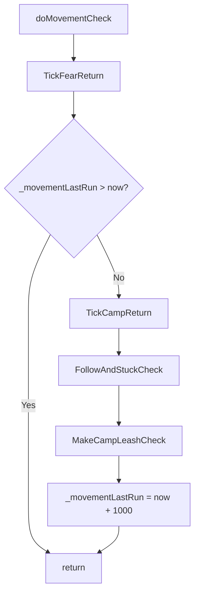

# Hook: doMovementCheck

**Priority:** 1350  
**Provider:** Built-in (botlogic.lua)  
**runWhenBusy:** true

## Logic

Runs when the bot is busy (e.g. casting) in a second pass after the priority loop, so camp return and follow/stuck logic still run. **TickFearReturn** runs every call (every ~250ms mainloop pass). Camp return, follow, and leash are throttled to once per second.

```mermaid
flowchart TB
    Start[doMovementCheck] --> Fear[TickFearReturn]
    Fear --> Throttle{_movementLastRun > now?}
    Throttle -->|Yes| End[return]
    Throttle -->|No| CampTick[TickCampReturn]
    CampTick --> Follow[FollowAndStuckCheck]
    Follow --> Camp[MakeCampLeashCheck]
    Camp --> SetLast[_movementLastRun = now + 1000]
    SetLast --> End
```

- **TickFearReturn:** Edge-detect `Me.Feared`. Rising edge saves `Me.X/Y/Z`, stops stick/attack/nav (keeps `engageTargetId`), sets busy **fear_return** `phase=feared`. Falling edge starts `/nav locxyz` to the saved point (`phase=returning`). While returning with **domelee** on (or travel-attack override): if live engage target is within **settings.acleash**, abort nav and clear busy so melee re-engages. With **domelee** off, always finish nav to the saved XYZ (heal/debuff spot). Else clear when within **campRestDistance** of the saved XYZ. Skips camp leash and follow while `fear_return` is active.
- **FollowAndStuckCheck:** TickReturnToFollowAfterEngage (engage_return_follow phases). TickUnstuck (unstuck phases; runs unconditionally so follow success can clear the busy state even when `shouldCallFollow` is false). **tickFollowCatchUp** clears **`followCatchUp`** once the bot reaches within **`followdistance`** during an active engagement. Refresh followid; if shouldCallFollow (distance >= followdistance, follow nav not suppressed) then FollowCall (UnStuck if stucktimer passed, stand, nav to leader). Follow nav is suppressed when engagement is active and **`followCatchUp`** is false (post catch-up maneuver). Charinfo peers use `/nav locxyz` to charinfo-published coords; non-peers use `/nav id` to followid. Update stucktimer when within leash (also clears unstuck when within acleash). Skipped entirely while **fear_return**.
- **MakeCampLeashCheck:** When **Leash to radius** is on and the player is beyond **acleash** of the camp pin, resets combat and returns to camp even while engaging. Otherwise, if campstatus and no engageTargetId and not casting (non-BRD): if over **campRestDistance** (distance or LOS), doLeashResetCombat and MakeCamp('return'). Skipped while **fear_return**.

UnStuck (called from FollowCall on entry) sets runState **unstuck** with phases nav_wait5, nudge_wait. TickUnstuck clears it when follow recovers (within acleash, or close with nav inactive). MakeCamp('return') sets **camp_return**. StartReturnToFollowAfterEngage (from doMelee) sets **engage_return_follow**; TickReturnToFollowAfterEngage clears it when nav done or deadline.

## See also

- [README](README.md)
- [Run state machine](run-state-machine.md)
- [Movement and misc state](movement-and-misc.md) — Unstuck, camp return, fear return, engage-return-follow
- [hook-domelee](hook-domelee.md) — StartReturnToFollowAfterEngage, TickReturnToFollowAfterEngage
- [hook-domisctimer](hook-domisctimer.md) — DragCheck (doMiscTimer does not run follow/camp)
