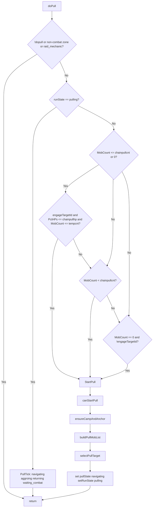

# Hook: doPull

**Priority:** 800  
**Provider:** botpull

## Logic

When runState is **pulling**, the hook runs PullTick (state machine). Otherwise it decides whether to start a new pull (chain pull conditions or idle with no engage).

- **StartPull:** Requires canStartPull (no MasterPause, HP > 45%, nav mesh, group checks); ensureCampAndAnchor (mapfilter, makecamp or hunter anchor); buildPullMobList (spawnutils); selectPullTarget (closest by path, or priority list if usepriority). Then /attack off, /stick off, /target clear, /nav to spawn; set pullAPTargetID, pullTagTimer, pullReturnTimer, pullState = 'navigating', setRunState('pulling', { priority = doPull }).
- **PullTick:** See [Movement and misc state](movement-and-misc.md#pull-state-machine-dopull) for navigating → aggroing → returning → waiting_combat.

## See also

- [README](README.md)
- [Run state machine](run-state-machine.md)
- [Movement and misc state](movement-and-misc.md) — pull state machine
- [Pull configuration](../pull-configuration.md)
