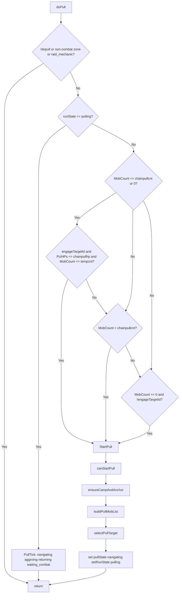

# Hook: doPull

**Priority:** 800  
**Provider:** botpull

## Logic

When runState is **pulling**, the hook runs PullTick (state machine). Otherwise it decides whether to start a new pull (chain pull conditions or idle with no engage).

While **dopull** is on, the hook also keeps MQ2Map **SpellRadius** (green ring) aligned with **pull.radius** and **CastRadius** with the effective pull range. Updates are throttled via last-applied state in `botpull.syncPullMapFilter`; enabling pull (`/cz dopull on` or the status-tab toggle) forces an immediate sync. When **dopull** is off, czbot does not adjust map radii.

```mermaid
flowchart TB
    Start[doPull] --> Guards{!dopull or non-combat zone or raid_mechanic?}
    Guards -->|Yes| End[return]
    Guards -->|No| Pulling{runState == pulling?}
    Pulling -->|Yes| Tick[PullTick: navigating aggroing returning waiting_combat]
    Pulling -->|No| Chain{MobCount <= chainpullcnt or 0?}
    Chain -->|Yes| EngageHP{engageTargetId and PctHPs <= chainpullhp and MobCount <= tempcnt?}
    EngageHP -->|Yes| StartPull[StartPull]
    Chain -->|No| LowMob{MobCount < chainpullcnt?}
    LowMob -->|Yes| StartPull
    Chain -->|No| Zero{MobCount == 0 and !engageTargetId?}
    Zero -->|Yes| StartPull
    LowMob -->|No| Zero
    EngageHP -->|No| LowMob
    StartPull --> CanStart[canStartPull]
    CanStart --> CampAnchor[ensureCampAndAnchor]
    CampAnchor --> BuildList[buildPullMobList]
    BuildList --> Select[selectPullTarget]
    Select --> Nav[set pullState navigating setRunState pulling]
    Tick --> End
    Nav --> End
```

- **Map radii:** Each doPull tick (when dopull is on) calls `syncPullMapFilter`; StartPull also calls it via ensureCampAndAnchor.
- **StartPull:** Requires canStartPull (no MasterPause, HP > 45%, nav mesh, group checks); ensureCampAndAnchor (syncPullMapFilter, makecamp or hunter anchor); buildPullMobList (spawnutils); selectPullTarget (closest by path, or priority list if usepriority). Then /attack off, /stick off, /mqtarget clear, /nav to spawn; set pullAPTargetID, pullTagTimer, pullReturnTimer, pullState = 'navigating', setRunState('pulling', { priority = doPull }).
- **PullTick:** See [Movement and misc state](movement-and-misc.md#pull-state-machine-dopull) for navigating → aggroing → returning → waiting_combat.

## See also

- [README](README.md)
- [Run state machine](run-state-machine.md)
- [Movement and misc state](movement-and-misc.md) — pull state machine
- [Pull configuration](../pull-configuration.md)
