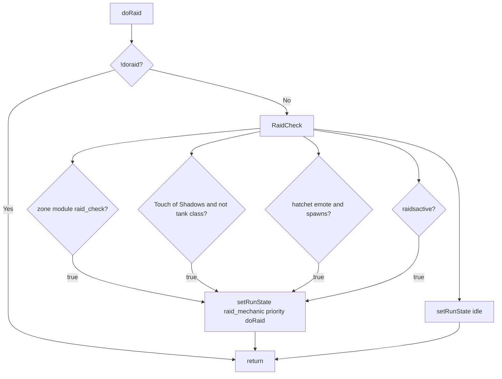

# Hook: doRaid

**Priority:** 350  
**Provider:** botraid

## Logic

When raid mechanics are active (zone module, Touch of Shadows, hatchet emote, or raidsactive), the hook sets runState **raid_mechanic** so only hooks with priority <= doRaid run. Otherwise it sets idle.

RaidCheck(): Load zone module (raid.{shortname}); if it has raid_check() and returns true, return true. Else check Touch of Shadows (Beltron debuff) for non-tank classes. Else check hatchet emote (DoDH) and call HatchetKite/HatchetSafe etc. if configured. Else if raidsactive (global) return true. Otherwise return false so doRaid sets idle.

## See also

- [README](README.md)
- [Run state machine](run-state-machine.md)
- [Raid mode](../raid-mode.md)
