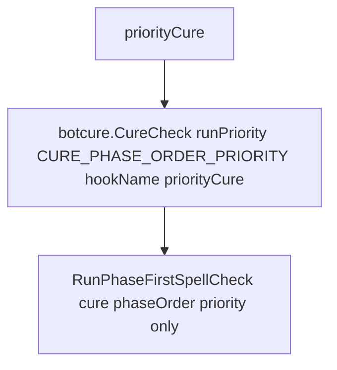

# Hook: priorityCure

**Priority:** 700  
**Provider:** botcure

## Logic

Same as the cure hook but uses a **priority-only** phase order so only spells configured for the "priority" band run. Used for high-priority cures (e.g. critical dispels) before the full cure loop.

CURE_PHASE_ORDER_PRIORITY is `{ 'priority' }`. Cure bands define which spells apply to the "priority" phase; only those are evaluated. Otherwise the flow is the same as [hook-docure](hook-docure.md): RunPhaseFirstSpellCheck → getTargetsForPhase → checkIfTargetNeedsSpells → CastSpell. See [Spell casting flow](spell-casting-flow.md) and [Curing configuration](../curing-configuration.md).

## See also

- [README](README.md)
- [hook-docure](hook-docure.md)
- [Spell casting flow](spell-casting-flow.md)
- [Curing configuration](../curing-configuration.md)
