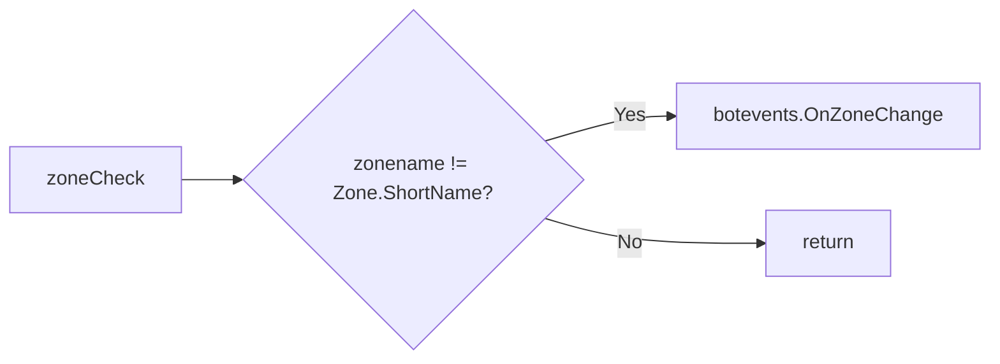

# Hook: zoneCheck

**Priority:** 100  
**Provider:** Built-in (botlogic.lua)

## Logic

If the current zone short name differs from `state.getRunconfig().zonename`, the hook calls **botevents.OnZoneChange()**, which runs DelayOnZone (reset camp, dopull, engageTargetId, mobfilter, spellstates, etc.) and updates zonename. See [Events](events.md#onzonechange-and-delayonzone).

## See also

- [README](README.md)
- [Run state machine](run-state-machine.md)
- [Events](events.md)
