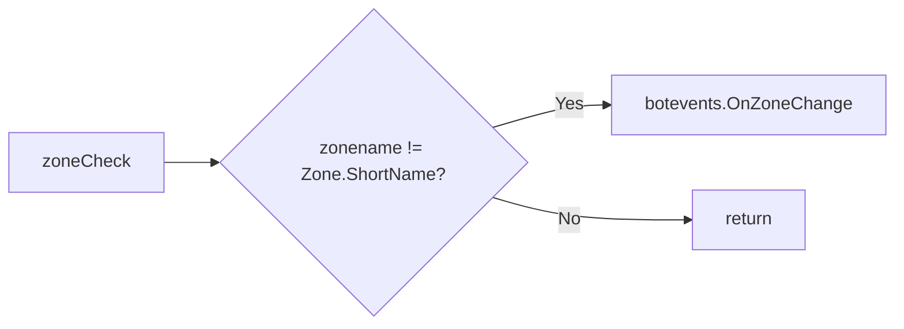

# Hook: zoneCheck

**Priority:** 100  
**Provider:** Built-in (botlogic.lua)

## Logic

```mermaid
flowchart LR
    A[zoneCheck] --> B{zonename != Zone.ShortName?}
    B -->|Yes| C[botevents.OnZoneChange]
    B -->|No| D[return]
```

If the current zone short name is non-empty and differs from `state.getRunconfig().zonename`, the hook calls **botevents.OnZoneChange()**. Empty/nil `Zone.ShortName()` is ignored (TLO flicker). See [Events](events.md#onzonechange-and-delayonzone).

## See also

- [README](README.md)
- [Run state machine](run-state-machine.md)
- [Events](events.md)
