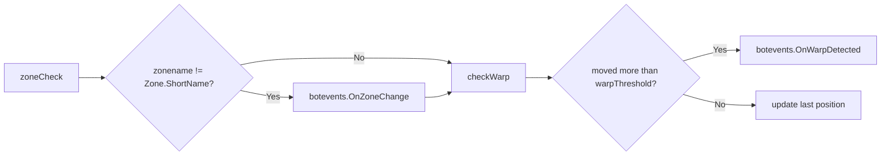

# Hook: zoneCheck

**Priority:** 100  
**Provider:** Built-in (botlogic.lua)

## Logic

```mermaid
flowchart LR
    A[zoneCheck] --> B{zonename != Zone.ShortName?}
    B -->|Yes| C[botevents.OnZoneChange]
    B -->|No| D[checkWarp]
    C --> D
    D --> E{moved more than warpThreshold?}
    E -->|Yes| F[botevents.OnWarpDetected]
    E -->|No| G[update last position]
```

1. If the current zone short name is non-empty and differs from `state.getRunconfig().zonename`, the hook calls **botevents.OnZoneChange()** (short-name mismatch required). Empty/nil `Zone.ShortName()` is ignored (TLO flicker).
2. Then **botevents.checkWarp()** samples `Me.X/Y/Z`. If the 3D distance from the previous sample exceeds **settings.warpThreshold** (default 600; `<= 0` disables), it calls **OnWarpDetected**, which runs the same **DelayOnZone** reset as a zone change (no 1s delay). Position is reseated after any zone/loading/warp reset.

See [Events](events.md#onzonechange-and-delayonzone).

## See also

- [README](README.md)
- [Run state machine](run-state-machine.md)
- [Events](events.md)
