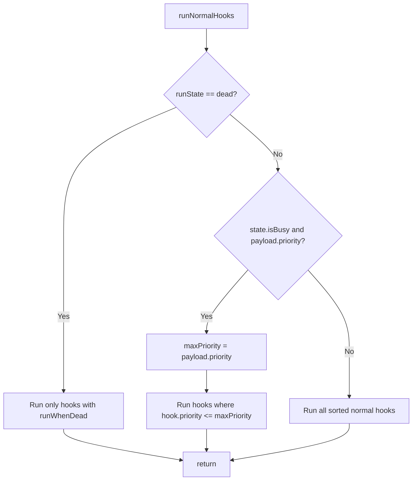

# Main loop and hook order

This page documents the exact behavior of `runNormalHooks()` in `lib/hookregistry.lua` and the full hook configuration from `lib/bothooks.lua`.

## runNormalHooks() flowchart

- **Dead:** Only hooks with `runWhenDead = true` are invoked (doEvents, charState). Then return; no other normal hooks run.
- **Busy:** If `state.isBusy()` is true and the payload has a numeric `priority`, only hooks with `hook.priority <= payload.priority` run. That keeps the owning hook (e.g. doPull at 800) and all higher-priority hooks (zoneCheck through doMelee) running; doHeal, doDebuff, doBuff, doCure, doMovementCheck, doMiscTimer are skipped until state is cleared. After that loop, the registry runs hooks with **runWhenBusy = true** (e.g. **doMovementCheck**), so camp return and follow still run when busy (e.g. when casting).
- **Otherwise:** All normal hooks run in sorted order (by priority, then name).

Hooks are sorted by priority ascending, then by name. Each hook is called as `h.fn(h.name)`.

---

## Hook table (bothooks.lua)

| Name | Priority | Provider | runWhenDead | runWhenBusy | runWhenPaused | Deep-dive |
|------|----------|----------|-------------|-------------|--------------|-----------|
| zoneCheck | 100 | — (built-in) | — | — | — | [hook-zonecheck](hook-zonecheck.md) |
| doEvents | 200 | — (built-in) | true | — | — | [hook-doevents](hook-doevents.md) |
| charState | 300 | — (built-in) | true | — | — | [hook-charstate](hook-charstate.md) |
| doRaid | 350 | botraid | — | — | — | [hook-doraid](hook-doraid.md) |
| AddSpawnCheck | 400 | lib.spawnutils | — | — | — | [hook-addspawncheck](hook-addspawncheck.md) |
| chchainTick | 500 | lib.chchain | — | — | — | [hook-chchain](hook-chchain.md) |
| doMelee | 600 | botmelee | — | — | — | [hook-domelee](hook-domelee.md) |
| priorityCure | 700 | botcure | — | — | — | [hook-prioritycure](hook-prioritycure.md) |
| doPull | 800 | botpull | — | — | — | [hook-dopull](hook-dopull.md) |
| doHeal | 900 | botheal | — | — | — | [hook-doheal](hook-doheal.md) |
| doDebuff | 1000 | botdebuff | — | — | — | [hook-dodebuff](hook-dodebuff.md) |
| doBuff | 1100 | botbuff | — | — | — | [hook-dobuff](hook-dobuff.md) |
| doCure | 1200 | botcure | — | — | — | [hook-docure](hook-docure.md) |
| doMovementCheck | 1350 | — (built-in) | — | true | — | [hook-domovementcheck](hook-domovementcheck.md) |
| doMiscTimer | 1400 | — (built-in) | — | — | — | [hook-domisctimer](hook-domisctimer.md) |

No hooks currently set `runWhenPaused = true`. Built-in hooks (zoneCheck, doEvents, charState, doMovementCheck, doMiscTimer) are implemented in `botlogic.lua` and registered via `registerHookFn` before `registerAllFromConfig()`; providers supply their hook function via `getHookFn(name)`.

---

## See also

- [README](README.md) — One-tick flow and high-level hook list
- [Run state machine](run-state-machine.md) — Which states are busy and who sets them
- [Events](events.md) — What doEvents processes
