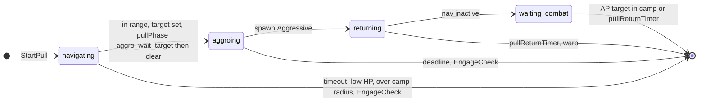
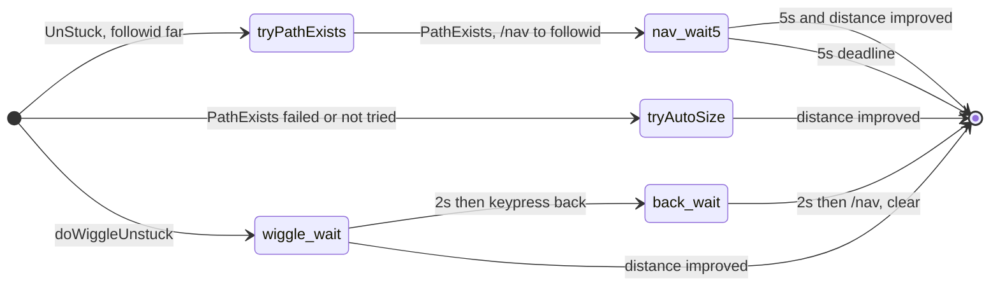
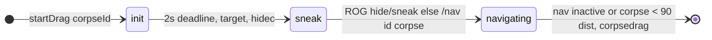

# Movement and misc state machines

Pull, unstuck, dragging, camp return, and engage-return-follow are driven from **doPull** and **doMiscTimer** (and from **doMelee** for engage_return_follow). This page summarizes their state machines and conditions. Implementation: `botpull.lua`, `botmove.lua`.

---

## Pull state machine (doPull)

runState **pulling** is set by `botpull.StartPull()` and cleared by `clearPullState()`. Pull also uses `rc.pullState` for sub-phases.

- **StartPull:** Requires `canStartPull(rc)` (no MasterPause, HP > 45%, nav mesh, group mana if configured, etc.). Then `ensureCampAndAnchor`, `buildPullMobList`, `selectPullTarget`; nav to spawn; set `pullAPTargetID`, `pullTagTimer`, `pullReturnTimer`, `pullState = 'navigating'`, `state.setRunState('pulling', { priority = doPull })`.
- **tickNavigating:** Tag timeout → clear. Low HP or over camp radius → clear. In range and LOS → target; if EngageCheck (someone else has aggro) → clear. In ability range → `pullState = 'aggroing'`, `pullPhase = 'aggro_wait_target'`, nav stop. Otherwise resume nav if needed.
- **tickAggroing:** Sub-phases: aggro_wait_target (deadline or target set), aggro_wait_cast (cast done), aggro_wait_stop_moving (deadline or not moving). When spawn is Aggressive → `pullState = 'returning'`, set pulledmob/pullreturntimer, ResetCombatState, NavToCamp. Else try pull ability (disc/ability/alt/gem/ranged/melee/warp); if moving and need to stand still, set aggro_wait_stop_moving.
- **tickReturning:** If nav inactive → `pullState = 'waiting_combat'`. If pullReturnTimer → clear. Warp pull → warp and clear. Pause nav when mob over leash, unpause when under.
- **tickWaitingCombat:** If domelee, call AdvCombat. If pull AP target is in MobList or pullReturnTimer passed → clearPullState.

See [hook-dopull](hook-dopull.md) for when doPull decides to call StartPull (chain pull, MobCount, engageTargetId).

---

## Unstuck (doMiscTimer → FollowAndStuckCheck → UnStuck)

runState **unstuck** is set by `botmove.UnStuck()` with phases: nav_wait5, wiggle_wait, back_wait. Cleared by `tickUnstuckPhase` when distance improves or deadline.

- **UnStuck:** Only runs when followid is set and distance >= acleash. If already in unstuck, tickUnstuckPhase runs. Then try PathExists → nav to followid, set unstuck phase nav_wait5 (5s). Else try AutoSize (if loaded) to shrink and recheck distance. Else doWiggleUnstuck: random heading/size, set phase wiggle_wait (2s).
- **tickUnstuckPhase:** nav_wait5: when deadline, if distance improved set stucktimer and clear; else clear. wiggle_wait: when deadline, /nav to followid, then set back_wait (2s). back_wait: when deadline, keypress back release, /nav; if distance improved set stucktimer; clear.

---

## Dragging (doMiscTimer → DragCheck)

runState **dragging** is set by `botmove.startDrag()` with phases: init, sneak, navigating. Cleared when nav stops or corpse is close and /corpsedrag runs.

- **DragCheck:** If runState dragging, tickDragging (see below). Else findCorpseToDrag (peer corpses in range). If corpse and PathExists, startDrag: if DragHack and not justDidSumcorpse, /sumcorpse; else set runState dragging phase init (2s).
- **tickDragging:** init: after deadline, target corpse, set phase sneak. sneak: ROG uses sneak/hide until ready then /nav id corpse and phase navigating. navigating: when nav inactive clear; when corpse distance < 90, /corpsedrag, /nav stop, clear.

See [Corpse dragging](../corpse-dragging.md) for configuration.

---

## Camp return

runState **camp_return** is set by `botmove.MakeCamp('return')` (doLeashResetCombat, doNavToCamp, setRunState camp_return with 5s deadline). Cleared in **CharState**: when not moving or deadline passed, clearRunState. **MakeCampLeashCheck** (doMiscTimer) can trigger return when campstatus and no engageTargetId and over leash (distance or LOS): doLeashResetCombat then MakeCamp('return').

---

## Engage return follow

runState **engage_return_follow** is set by `botmove.StartReturnToFollowAfterEngage()` when MT refinds engage target and follow is valid (distance >= followdistance, not corpse). Cleared by **botmove.TickReturnToFollowAfterEngage** when phase finishes (nav inactive or deadline). **doMelee** runs TickReturnToFollowAfterEngage when runState == engage_return_follow before doing melee logic.

Phases:

- **delay_400:** After 400ms, set phase nav_wait with 10s deadline.
- **nav_wait:** When nav inactive or 10s deadline, clearRunState.

StartReturnToFollowAfterEngage does: stick off, attack off, target self, FollowCall (nav to followid), then setRunState engage_return_follow phase delay_400.

---

## See also

- [Run state machine](run-state-machine.md) — pulling, dragging, camp_return, engage_return_follow, unstuck
- [hook-dopull](hook-dopull.md) — When StartPull is called
- [hook-domisctimer](hook-domisctimer.md) — DragCheck, FollowAndStuckCheck, MakeCampLeashCheck
- [hook-domelee](hook-domelee.md) — TickReturnToFollowAfterEngage, StartReturnToFollowAfterEngage
- [Corpse dragging](../corpse-dragging.md)
