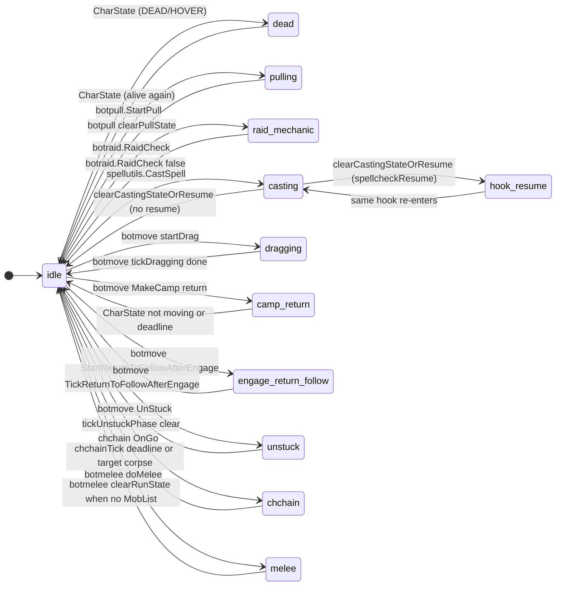

# Run state machine

The bot's main loop behavior is driven by `runState` (and optional `runStatePayload`) in `lib/state.lua`. This page documents all states, who sets them, and how they affect which hooks run.

## How the main loop uses runState

- **runState == 'dead'** — Character is DEAD or HOVER. Only hooks with `runWhenDead = true` run (doEvents, charState). See [Main loop and hooks](main-loop-and-hooks.md).
- **runState is busy** — `state.isBusy()` is true when `runState` is one of: `pulling`, `raid_mechanic`, `casting`, `dragging`, `camp_return`, `engage_return_follow`, `unstuck`, `chchain`. Then only hooks with `hook.priority <= payload.priority` run, so the owner of the activity (and higher-priority hooks) keep running; lower-priority hooks are skipped.
- **Otherwise** (idle, dead, or melee) — For idle and melee, all normal hooks run. For dead, the runWhenDead rule above applies.

## State diagram

Note: `melee` is not a busy state; it does not restrict which hooks run. It carries a phase (e.g. `moving_closer`) and priority so doMelee can avoid re-entering engage logic until movement is done.

## State reference table

| State | Busy? | Set by | Cleared by | Payload fields |
|-------|------|--------|------------|----------------|
| idle | No | clearRunState, botraid (RaidCheck false) | — | — |
| dead | No | botlogic CharState (DEAD/HOVER) | CharState when alive | — |
| pulling | Yes | botpull.StartPull | botpull clearPullState | priority (doPull) |
| raid_mechanic | Yes | botraid.RaidCheck true | botraid.RaidCheck false | priority (doRaid) |
| casting | Yes | spellutils.CastSpell | clearCastingStateOrResume | priority, spellcheckResume |
| dragging | Yes | botmove startDrag | botmove tickDragging | priority, corpseID, phase |
| camp_return | Yes | botmove MakeCamp return | CharState (not moving or deadline) | priority, deadline |
| engage_return_follow | Yes | botmove StartReturnToFollowAfterEngage | botmove TickReturnToFollowAfterEngage | priority, phase, deadline |
| unstuck | Yes | botmove UnStuck (PathExists, wiggle) | tickUnstuckPhase | priority, phase, deadline, followid, stuckdistance |
| chchain | Yes | chchain OnGo | chchainTick (deadline or target corpse) | priority, deadline, chnextclr |
| melee | No | botmelee doMelee | botmelee when no MobList | phase, priority, deadline |
| hook_resume | Yes | clearCastingStateOrResume (with spellcheckResume) | same hook re-enters and CastSpell | phase, targetIndex, spellIndex, hook name |

Resume states are named `{hookName}_resume` (e.g. `doHeal_resume`). They are busy and carry the hook's priority so only that hook (and higher-priority hooks) run until the cast is finished and state is cleared or another cast starts.

## See also

- [README](README.md) — One-tick flow and hook list
- [Main loop and hooks](main-loop-and-hooks.md) — Exact filtering logic
- Hooks that set/clear state: [doPull](hook-dopull.md), [doRaid](hook-doraid.md), [doMelee](hook-domelee.md), [doMiscTimer](hook-domisctimer.md), [chchain](hook-chchain.md), [Spell casting flow](spell-casting-flow.md), [Movement and misc state](movement-and-misc.md)
