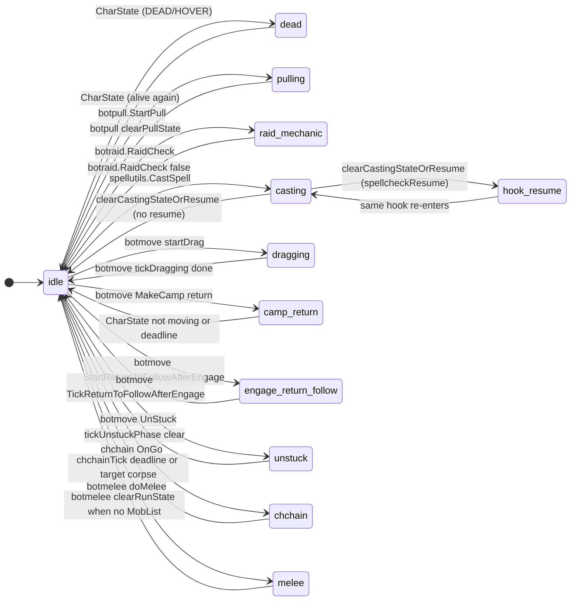

# Run state machine

The bot's main loop behavior is driven by `runState` (a **number**) and optional `runStatePayload` in `lib/state.lua`. There is no string state support; all comparisons use **state.STATES.*** or **state.RESUME_BY_HOOK**.

## Numeric enum (state.STATES)

- **runState** is always a number. **state.getRunState()** returns a number; **state.setRunState(stateNum, payload)** accepts a number only.
- **Fixed states (1..12):** idle = 1, dead = 2, pulling = 3, raid_mechanic = 4, casting = 5, melee = 6, camp_return = 7, engage_return_follow = 8, unstuck = 9, dragging = 10, chchain = 11, sumcorpse_pending = 12.
- **Resume states (1000+):** resume_doHeal = 1001, resume_doDebuff = 1002, resume_doBuff = 1003, resume_doCure = 1004, resume_priorityCure = 1005. **state >= 1000** means resume. Use **state.RESUME_BY_HOOK[hookName]** to get the resume state number when setting from spellutils (e.g. `state.setRunState(state.RESUME_BY_HOOK[p.spellcheckResume.hook], payload)`).
- **Display:** **state.getRunStateName()** returns a string for the current state (from a numeric→name map only; no string comparison of state).

## BUSY_STATES (gate the main loop)

When `runState` is one of the fixed busy state numbers, `state.isBusy()` is true and only hooks with `hook.priority <= payload.priority` run: pulling, raid_mechanic, casting, dragging, camp_return, engage_return_follow, unstuck, chchain.

**Resume states** (runState >= 1000) are **not** busy; they do not gate the loop. They only supply a resume cursor for `RunPhaseFirstSpellCheck`.

## Allowed states and transitions

`setRunState(stateNum, payload)` only applies when `stateNum` is one of the exported STATE constants (in state.STATES). Transitions to busy states (and to melee) are gated by **state.canStartBusyState(stateNum)**; if disallowed, `setRunState` does nothing. Transitions to idle, dead, or any resume state (>= 1000) are always allowed.

## How the main loop uses runState

- **runState == state.STATES.dead** — Character is DEAD or HOVER. Only hooks with `runWhenDead = true` run (doEvents, charState). See [Main loop and hooks](main-loop-and-hooks.md).
- **runState is busy** — Only hooks with `hook.priority <= payload.priority` run. After that loop, if still busy, hooks with **runWhenBusy = true** run (e.g. doMovementCheck), so movement (camp return, follow) runs even when stuck in casting.
- **Otherwise** (idle, melee, or _resume) — All normal hooks run (no priority filter).

## State diagram

Note: `melee` is not a busy state; it does not restrict which hooks run. It carries a phase (e.g. `moving_closer`) and priority so doMelee can avoid re-entering engage logic until movement is done.

## State reference table

| State | Busy? | Set by | Cleared by | Payload fields |
|-------|------|--------|------------|----------------|
| idle | No | clearRunState, botraid (RaidCheck false) | — | — |
| dead | No | botlogic CharState (DEAD/HOVER) | CharState when alive | — |
| pulling | Yes | botpull.StartPull | botpull clearPullState | priority (doPull) |
| raid_mechanic | Yes | botraid.RaidCheck true | botraid.RaidCheck false | priority (doRaid) |
| casting | Yes | spellutils.CastSpell | clearCastingStateOrResume | priority, spellcheckResume |
| dragging | Yes | botmove startDrag | botmove tickDragging | priority, corpseID, phase |
| camp_return | Yes | botmove MakeCamp return | CharState (not moving or deadline) | priority, deadline |
| engage_return_follow | Yes | botmove StartReturnToFollowAfterEngage | botmove TickReturnToFollowAfterEngage | priority, phase, deadline |
| unstuck | Yes | botmove UnStuck (PathExists, wiggle) | tickUnstuckPhase | priority, phase, deadline, followid, stuckdistance |
| chchain | Yes | chchain OnGo | chchainTick (deadline or target corpse) | priority, deadline, chnextclr |
| melee | No | botmelee doMelee | botmelee when no MobList | phase, priority, deadline |
| hook_resume | No | clearCastingStateOrResume (with spellcheckResume) | same hook re-enters and CastSpell or clearRunState at loop end | phase, targetIndex, spellIndex, hook name |

When casting uses MQ2Cast, completion is detected via Cast.Status/Result in spellutils.handleSpellCheckReentry (see [Spell casting flow](spell-casting-flow.md)).

Resume states are numeric (e.g. state.STATES.resume_doHeal = 1001). They are **not** busy; they only supply a cursor so the phase-first spell loop can resume. Use **state.RESUME_BY_HOOK[hookName]** to get the state number. All hooks run when in a resume state.

## Single exit from casting

All code that leaves the "casting" busy state must call **spellutils.clearCastingStateOrResume()**. It clears CurSpell/statusMessage, then either sets `hookName_resume` (if payload has spellcheckResume) or clearRunState(). CharState also calls it when casting appears stuck (effectively idle: no mobs and not casting, or deadline passed and CastTimeLeft 0).

## Interruption rules (canStartBusyState)

Before setting any busy state, call **state.canStartBusyState(stateNum)** with a number (e.g. state.STATES.pulling). Central rules:

- **idle / melee / resume (>= 1000)** — Any activity may start.
- **pulling** — Not allowed if currently casting or Me.Casting()/CastTimeLeft > 0.
- **casting** — Not allowed if already in another busy state (same-activity re-entry is allowed).
- **camp_return, engage_return_follow** — Allowed even over casting (so stuck casters can return to camp / follow).
- **unstuck, dragging, chchain, raid_mechanic** — Not allowed over casting (only same-activity or from idle/melee/resume state).

## See also

- [README](README.md) — One-tick flow and hook list
- [Main loop and hooks](main-loop-and-hooks.md) — Exact filtering logic
- Hooks that set/clear state: [doPull](hook-dopull.md), [doRaid](hook-doraid.md), [doMelee](hook-domelee.md), [doMiscTimer](hook-domisctimer.md), [chchain](hook-chchain.md), [Spell casting flow](spell-casting-flow.md), [Movement and misc state](movement-and-misc.md)
