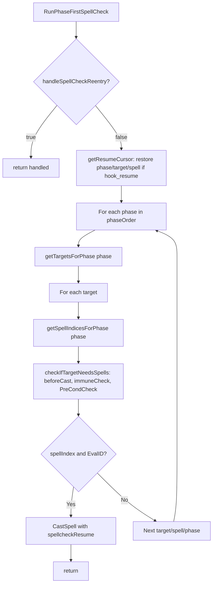
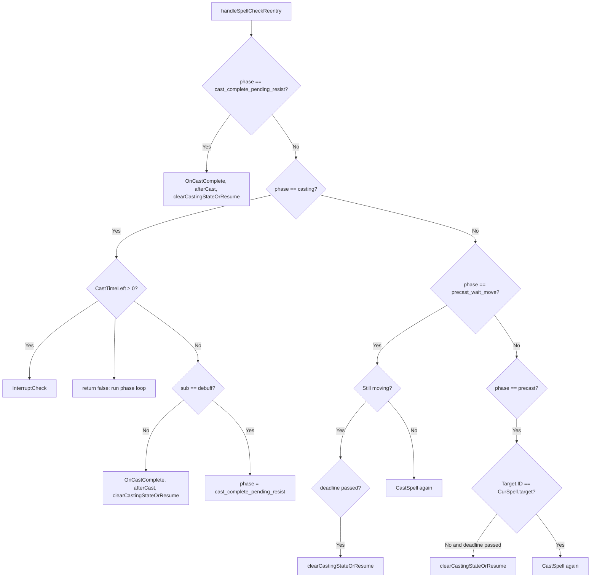

# Spell casting flow

Heal, buff, debuff, and cure hooks share the same casting pipeline in `lib/spellutils.lua`: they use **RunPhaseFirstSpellCheck** to pick phase → targets → spell, then **CastSpell** to set target, cast, and set `runState = 'casting'`. When the cast finishes (or is interrupted), **clearCastingStateOrResume** either clears state or sets a **hook_resume** state so the same hook continues on the next tick. This page charts that flow.

## RunPhaseFirstSpellCheck

The phase-first loop decides *what* to cast by iterating phases in order, then for each phase over targets and spells until it finds a valid (spellIndex, EvalID, targethit) and calls CastSpell.



- **handleSpellCheckReentry(sub, options):** If we are already in a cast (CurSpell phase = cast_complete_pending_resist, casting, precast_wait_move, precast), it either waits, runs InterruptCheck, or completes the cast and calls clearCastingStateOrResume; returns true so the phase loop does not run.
- **getResumeCursor(hookName):** If runState is `{hookName}_resume`, returns the payload (phase, targetIndex, spellIndex) so the loop can resume from that phase/target/spell after a cast completed.
- **spellcheckResume:** When starting a cast, the hook passes `{ hook = hookName, phase, targetIndex, spellIndex }`. When the cast ends, clearCastingStateOrResume sets runState to `hookName_resume` with that payload so the next time the hook runs it continues from the same place.

Phase order and target types are per section. See [Spell targeting and bands](../spell-targeting-and-bands.md) for band semantics.

| Section | Phase order (typical) |
|---------|------------------------|
| heal | corpse, self, groupheal, tank, groupmember, pc, mypet, pet, xtgt |
| debuff | charm, tanktar, notanktar, named |
| cure | self, tank, groupcure, groupmember, pc (priority cure uses a different order) |
| buff | self, byname, tank, groupbuff, groupmember, pc, mypet, pet |

---

## CastSpell / casting state

CastSpell sets `CurSpell`, may wait for movement or target, then issues the cast and sets `runState = 'casting'`.

```mermaid
flowchart TB
    CastStart[CastSpell] --> SpellCheck[SpellCheck, LoadSpell]
    SpellCheck --> CurSpell[Set CurSpell sub/spell/target/targethit etc]
    CurSpell --> Moving{Moving and cast time > 0 and not BRD?}
    Moving -->|Yes| PrecastMove[phase = precast_wait_move, setRunState casting, return]
    Moving -->|No| TargetOk{Target.ID == EvalID?}
    TargetOk -->|No| Precast[phase = precast, /tar, setRunState casting, return]
    TargetOk -->|Yes| DoCast[/cast or /disc or /doability]
    DoCast --> Casting[phase = casting, setRunState casting with spellcheckResume]
```

- **SpellCheck:** Reagents, mana/endurance, gem ready, etc.
- **LoadSpell:** Mem spell in gem if needed; set gemInUse; wait for mem if necessary. On spell-not-in-book, disables entry and clearRunState.
- **precast_wait_move:** If we are moving (or nav/stick active) and the spell has cast time, we set a 3s deadline and return; next tick we stop moving then re-call CastSpell.
- **precast:** If target is not set, we /tar and set a 1s deadline; next tick we re-call CastSpell.
- After the actual cast is fired, `rc.CurSpell.phase = 'casting'` and `state.setRunState('casting', { priority = runPriority, spellcheckResume })`.

---

## handleSpellCheckReentry (CurSpell phases)

When a hook runs and we are already in a cast, handleSpellCheckReentry handles waiting, interrupt, or completion instead of starting a new phase-first search.



- **cast_complete_pending_resist:** Used for debuff so we can run OnCastComplete after resist check (Event_CastRst). We run OnCastComplete, afterCast, then clearCastingStateOrResume.
- **casting:** If CastTimeLeft > 0 we run InterruptCheck (target lost, corpse, heal over-threshold, buff/debuff already present, etc.). If CastTimeLeft == 0: non-debuff runs OnCastComplete and clearCastingStateOrResume; debuff sets phase to cast_complete_pending_resist and returns (next tick we exit via P1).
- **precast_wait_move / precast:** Wait for deadline or condition; then either clearCastingStateOrResume or call CastSpell again to actually cast.

---

## clearCastingStateOrResume

When a cast ends (complete or interrupted):

1. Clear `rc.CurSpell` and `rc.statusMessage`.
2. If payload has `spellcheckResume` and `spellcheckResume.hook`: set runState to **`{hook}_resume`** with the spellcheckResume payload (phase, targetIndex, spellIndex). The hook’s next run will get this via getResumeCursor and continue the phase-first loop.
3. Otherwise: **clearRunState()** (back to idle).

---

## InterruptCheck

Runs while we are in `CurSpell.phase == 'casting'` and CastTimeLeft > 0. It can interrupt the cast and call clearCastingStateOrResume in cases such as:

- Target lost or target is corpse (and criteria is not corpse).
- Heal: target HP above interrupt threshold for that band.
- Buff/debuff: spell already on target (or doesn’t stack); update spellstates and /interrupt.

After /interrupt, clearCastingStateOrResume is called so state and CurSpell are cleared (or resume is set).

---

## See also

- [Run state machine](run-state-machine.md) — casting and hook_resume states
- [Spell targeting and bands](../spell-targeting-and-bands.md) — bands and phase semantics
- Hooks that use this flow: [doHeal](hook-doheal.md), [doDebuff](hook-dodebuff.md), [doBuff](hook-dobuff.md), [doCure](hook-docure.md), [priorityCure](hook-prioritycure.md)
- Implementation: `lib/spellutils.lua` (RunPhaseFirstSpellCheck, CastSpell, handleSpellCheckReentry, clearCastingStateOrResume, InterruptCheck)
