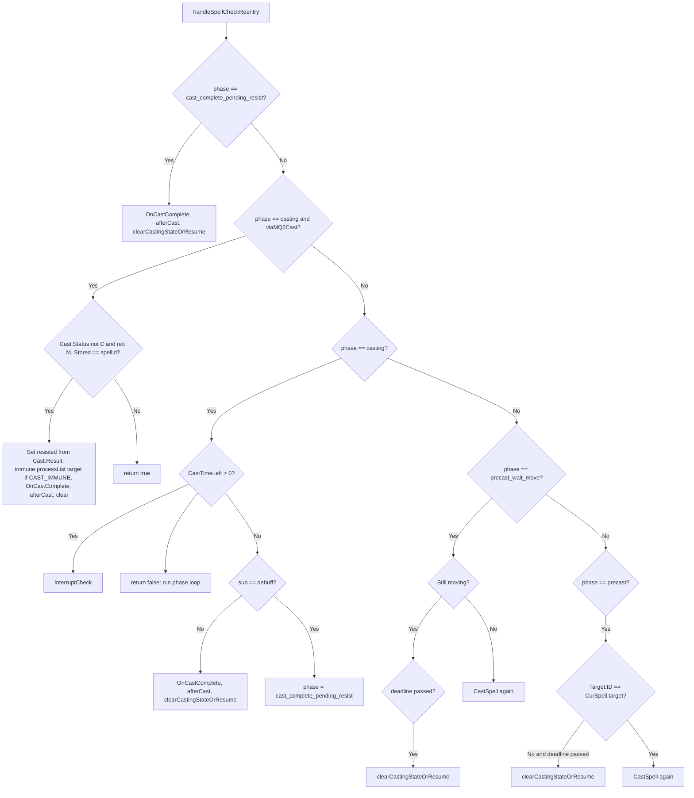

# Spell casting flow

Heal, buff, debuff, and cure hooks share the same casting pipeline in `lib/spellutils.lua`: they use **RunPhaseFirstSpellCheck** to pick phase → targets → spell, then **CastSpell** to set target, cast, and set `runState = 'casting'`. When the cast finishes (or is interrupted), **clearCastingStateOrResume** either clears state or sets a **hook_resume** state so the same hook continues on the next tick. This page charts that flow.

## RunPhaseFirstSpellCheck

The phase-first loop decides *what* to cast by iterating phases in order, then for each phase over targets and spells until it finds a valid (spellIndex, EvalID, targethit) and calls CastSpell.


- **handleSpellCheckReentry(sub, options):** If we are already in a cast (CurSpell phase = cast_complete_pending_resist, casting, precast_wait_move, precast), it either waits, runs InterruptCheck, or completes the cast and calls clearCastingStateOrResume; returns true so the phase loop does not run.
- **getResumeCursor(hookName):** If runState is `{hookName}_resume`, returns the payload (phase, targetIndex, spellIndex) so the loop can resume from that phase/target/spell after a cast completed.
- **spellcheckResume:** When starting a cast, the hook passes `{ hook = hookName, phase, targetIndex, spellIndex }`. When the cast ends, clearCastingStateOrResume sets runState to `hookName_resume` with that payload so the next time the hook runs it continues from the same place.

Phase order and target types are per section. See [Spell targeting and bands](../spell-targeting-and-bands.md) for band semantics.

| Section | Phase order (typical) |
|---------|------------------------|
| heal | corpse, self, groupheal, tank, groupmember, pc, mypet, pet, xtgt |
| debuff | charm, tanktar, notanktar, named |
| cure | self, tank, groupcure, groupmember, pc (priority cure uses a different order) |
| buff | self, byname, tank, groupbuff, groupmember, pc, mypet, pet |

---

## CastSpell / casting state

CastSpell sets `CurSpell`, may wait for movement or target, then issues the cast and sets `runState = 'casting'`. When MQ2Cast is loaded, spell/item/alt casts use `/casting` (with `-targetid` when needed and `-maxtries|2` for debuff) and skip the precast target step; completion and resist/immune are detected via `Cast.Result` in re-entry instead of chat events.

```mermaid
flowchart TB
    CastStart[CastSpell] --> SpellCheck[SpellCheck]
    SpellCheck --> CurSpell[Set CurSpell sub/spell/target/targethit etc]
    CurSpell --> Moving{Moving and cast time > 0 and not BRD?}
    Moving -->|Yes| PrecastMove[phase = precast_wait_move, setRunState casting, return]
    Moving -->|No| MQ2Cast{MQ2Cast loaded and spell/item/alt?}
    MQ2Cast -->|Yes| DoCasting["/casting with -targetid, -maxtries for debuff; viaMQ2Cast, spellid"]
    MQ2Cast -->|No| TargetOk{Target.ID == EvalID?}
    TargetOk -->|No| Precast[phase = precast, /tar, setRunState casting, return]
    TargetOk -->|Yes| DoCast[/cast or /disc or /doability]
    DoCasting --> Casting[phase = casting, setRunState casting with spellcheckResume]
    DoCast --> Casting
```

- **SpellCheck:** Reagents, mana/endurance, gem ready, etc. For gem spells, verifies the spell is in the character's book (`mq.TLO.Me.Book(spell)`); if not, the entry is disabled and the cast is aborted. There is no dynamic memorization or gemInUse in the current implementation. When using MQ2Cast, the bot relies on MQ2Cast to memorize the spell into the gem if needed as part of the `/casting` command; the script does not issue separate memorization commands.
- **precast_wait_move:** If we are moving (or nav/stick active) and the spell has cast time, we set a 3s deadline and return; next tick we stop moving then re-call CastSpell.
- **precast:** If target is not set (and not using MQ2Cast), we /tar and set a 1s deadline; next tick we re-call CastSpell. When the caster is the main tank, in combat, and the cast target is self, the precast target step is skipped so the MT does not untarget the mob.
- **MQ2Cast:** When the plugin is loaded and gem is spell/item/alt, we build `/casting "Spell" gem -targetid|id` (and `-maxtries|2` for debuff), set `CurSpell.viaMQ2Cast` and `CurSpell.spellid`, then set phase and run state. MQ2Cast memorizes the spell into the gem if necessary as part of `/casting`, so the script does not manage gem slots. Completion is detected in handleSpellCheckReentry via `Cast.Status` / `Cast.Result` / `Cast.Stored`. **Memorization** (Cast.Status contains 'M') is treated as part of the casting busy state: the bot does not clear casting state as stuck, does not run InterruptCheck, and does not stand for sit/stand logic until memorization finishes, so memorization is not interrupted.
- After the actual cast is fired, `rc.CurSpell.phase = 'casting'` and `state.setRunState('casting', { priority = runPriority, spellcheckResume })`.

---

## handleSpellCheckReentry (CurSpell phases)

When a hook runs and we are already in a cast, handleSpellCheckReentry handles waiting, interrupt, or completion instead of starting a new phase-first search. Two completion paths exist: **viaMQ2Cast** (poll `Cast.Status` / `Cast.Result` / `Cast.Stored`; resist/immune applied from `Cast.Result`), and **legacy** (CastTimeLeft + events).



- **cast_complete_pending_resist:** Used for debuff so we can run OnCastComplete after resist check (Event_CastRst). We run OnCastComplete, afterCast, then clearCastingStateOrResume.
- **casting (viaMQ2Cast):** Completion is when `Cast.Status` does not contain 'C' and does not contain 'M', and `Cast.Stored.ID()` equals `CurSpell.spellid`. Then set `CurSpell.resisted` from `Cast.Result`; on CAST_IMMUNE call `immune.processList(CurSpell.target)` (the target spawn ID) to update the immune list for that mob. Then OnCastComplete, afterCast, clearCastingStateOrResume. No CastTimeLeft or cast_complete_pending_resist for this path.
- **casting (legacy):** If CastTimeLeft > 0 we run InterruptCheck (target lost, corpse, heal over-threshold, buff/debuff already present, etc.). If CastTimeLeft == 0: non-debuff runs OnCastComplete and clearCastingStateOrResume; debuff sets phase to cast_complete_pending_resist and returns (next tick we exit via P1).
- **precast_wait_move / precast:** Wait for deadline or condition; then either clearCastingStateOrResume or call CastSpell again to actually cast.

---

## clearCastingStateOrResume

When a cast ends (complete or interrupted):

1. Clear `rc.CurSpell` and `rc.statusMessage`.
2. If payload has `spellcheckResume` and `spellcheckResume.hook`: set runState to **`{hook}_resume`** with the spellcheckResume payload (phase, targetIndex, spellIndex). The hook’s next run will get this via getResumeCursor and continue the phase-first loop.
3. Otherwise: **clearRunState()** (back to idle).

---

## InterruptCheck

Runs when `CurSpell.phase == 'casting'` for **both** MQ2Cast and legacy paths (for legacy, the "wait vs complete" decision uses CastTimeLeft; InterruptCheck is still invoked each tick while casting). For MQ2Cast, completion is determined by Cast.Status/Result only—CastTimeLeft is not used for completion. When MQ2Cast is **memorizing** (Cast.Status contains 'M' and no cast bar), InterruptCheck is not run so memorization is never interrupted. Otherwise InterruptCheck runs and can interrupt the cast and call clearCastingStateOrResume in cases such as:

- Target lost or target is corpse (and criteria is not corpse).
- Heal: target HP above interrupt threshold for that band.
- Buff/debuff: spell already on target (or doesn’t stack); update spellstates and /interrupt.

After /interrupt, clearCastingStateOrResume is called so state and CurSpell are cleared (or resume is set).

---

## See also

- [Run state machine](run-state-machine.md) — casting and hook_resume states
- [Spell targeting and bands](../spell-targeting-and-bands.md) — bands and phase semantics
- Hooks that use this flow: [doHeal](hook-doheal.md), [doDebuff](hook-dodebuff.md), [doBuff](hook-dobuff.md), [doCure](hook-docure.md), [priorityCure](hook-prioritycure.md)
- Implementation: `lib/spellutils.lua` (RunPhaseFirstSpellCheck, CastSpell, handleSpellCheckReentry, clearCastingStateOrResume, InterruptCheck)
