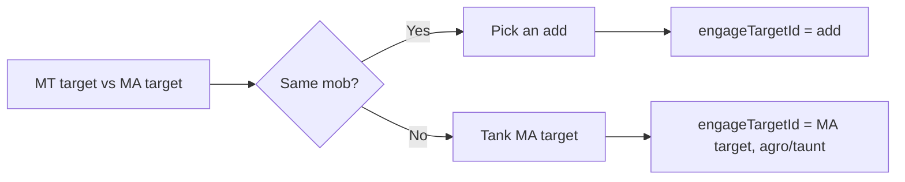

# Offtank Configuration

This document explains how to configure a bot as an **offtank**: picking an add when the MT and MA are on the same mob, or tanking the MA’s target when they are on different mobs. For MT/MA/Puller roles, see [Tank and Assist Roles](tank-and-assist-roles.md).

## Overview

- **AssistName (MA)** must be set so the offtank knows whose target to follow or tank.
- When **MT target == MA target** (same mob), the offtank picks an **add** — the Nth other mob in the camp list, where N is **otoffset** (0 = first add).
- When **MT target != MA target** (different mobs), the offtank **tanks the MA’s target** (sets engage target to the MA’s target and uses agro/taunt).

---

## Config file reference

### Melee section (offtank)

| Option | Default | Purpose |
|--------|--------|---------|
| **offtank** | `false` | Set to `true` to make this bot an offtank. |
| **otoffset** | 0 | When MT and MA are on the **same** mob, which add to pick: 0 = first other mob in the list, 1 = second, etc. |

**AssistName** is under **`settings.AssistName`**. The offtank logic uses the MA’s target; if AssistName is unset, the bot may treat the tank as assist (see [Tank and Assist Roles](tank-and-assist-roles.md)).

**Example**

```lua
['settings'] = {
  ['AssistName'] = "Mainassistname"
},
['melee'] = {
  ['offtank'] = true,
  ['otoffset'] = 0,
  ['stickcmd'] = 'hold uw 7',
  ['assistpct'] = 99
}
```

---

## Offtank decision



- **Same mob:** Offtank picks the **Nth add** in the mob list (N = **otoffset**).
- **Different mobs:** Offtank **tanks the MA’s target** (engage target = MA target; bot uses stick/agro/taunt).

---

## Runtime control

- **Toggle offtank:** `/cz offtank on` or `/cz offtank off`, or `/cz offtank` to toggle.
- **Set MA:** `/cz assist <name>` or `/cz assist automatic` (required for offtank behavior).

---

## Scenarios

- **Offtank bot:** Set **offtank** to `true` (config or `/cz offtank on`) and set **AssistName** to the Main Assist. If MT and MA are on the same mob, this bot picks an add (by **otoffset**). If MT and MA are on different mobs, this bot tanks the MA’s target.
- For more role scenarios (human MA, bot MT, automatic mode), see [Tank and Assist Roles — Scenarios](tank-and-assist-roles.md#scenarios-plain-english).
