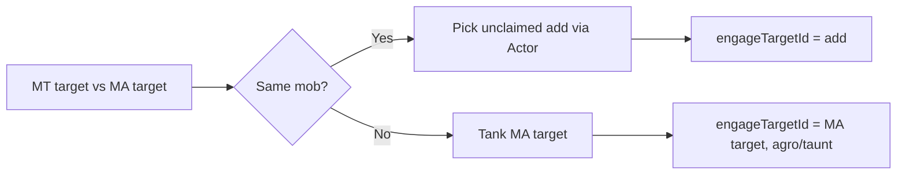

# Offtank Configuration

This document explains how to configure a bot as an **offtank**: picking an add when the MT and MA are on the same mob, or tanking the MA's target when they are on different mobs. For MT/MA/Puller roles, see [Tank and Assist Roles](tank-and-assist-roles.md).

## Overview

- **AssistName (MA)** must be set so the offtank knows whose target to follow or tank.
- When **MT target == MA target** (same mob), offtanks **coordinate adds via the [CZBot Actor channel](czbot-actor-channel.md)** (`ot_claim` / last-writer-wins). Each OT claims an unclaimed add; if all adds are claimed, the OT idles.
- When **MT target != MA target** (different mobs), the offtank **tanks the MA's target** (sets engage target to the MA's target and uses agro/taunt).
- Once engaged on an add or on the MA's off-target mob, the offtank **sticks on that target until it dies** (no `assistpct` gate; does not snap back to the main mob).
- **`onlyMT` debuffs** (e.g. Taunt with **When MT Only** checked) cast on the off-tank's current engage target while actively off-tanking — not on the main tank's mob.

---

## Config file reference

### Melee section (offtank)

| Option | Default | Purpose |
|--------|--------|---------|
| **offtank** | `false` | Set to `true` to make this bot an offtank. |

**AssistName** is under **`settings.AssistName`**. The offtank logic uses the MA's target; if AssistName is unset, the bot may treat the tank as assist (see [Tank and Assist Roles](tank-and-assist-roles.md)).

**Example**

```lua
['settings'] = {
  ['AssistName'] = "Mainassistname"
},
['melee'] = {
  ['offtank'] = true,
  ['stickcmd'] = 'hold uw 7',
  ['assistpct'] = 99
}
```

---

## Offtank decision


```mermaid
flowchart LR
    A[MT target vs MA target] --> B{Same mob?}
    B -->|Yes| C[Pick unclaimed add via Actor]
    B -->|No| D[Tank MA target]
    C --> E[engageTargetId = add]
    D --> F[engageTargetId = MA target, agro/taunt]
```

- **Same mob:** Offtanks publish **`ot_claim`** for an add; conflicts resolve **last-writer-wins** (newer timestamp keeps the add; loser re-picks or idles).
- **Different mobs:** Offtank **tanks the MA's target** (engage target = MA target; bot uses stick/agro/taunt) and **sticks until it dies**.

---

## Runtime control

- **Toggle offtank:** `/cz offtank on` or `/cz offtank off`, or `/cz offtank` to toggle.
- **Set MA:** `/cz assist <name>` or `/cz assist automatic` (required for offtank behavior).
- **Diagnostics:** `/cz actor status` — OT claims and peer state.

---

## Scenarios

- **Offtank bot:** Set **offtank** to `true` (config or `/cz offtank on`) and set **AssistName** to the Main Assist. If MT and MA are on the same mob, this bot claims an add via the Actor channel. If MT and MA are on different mobs, this bot tanks the MA's target.
- For more role scenarios (human MA, bot MT, automatic mode), see [Tank and Assist Roles — Scenarios](tank-and-assist-roles.md#scenarios-plain-english).
