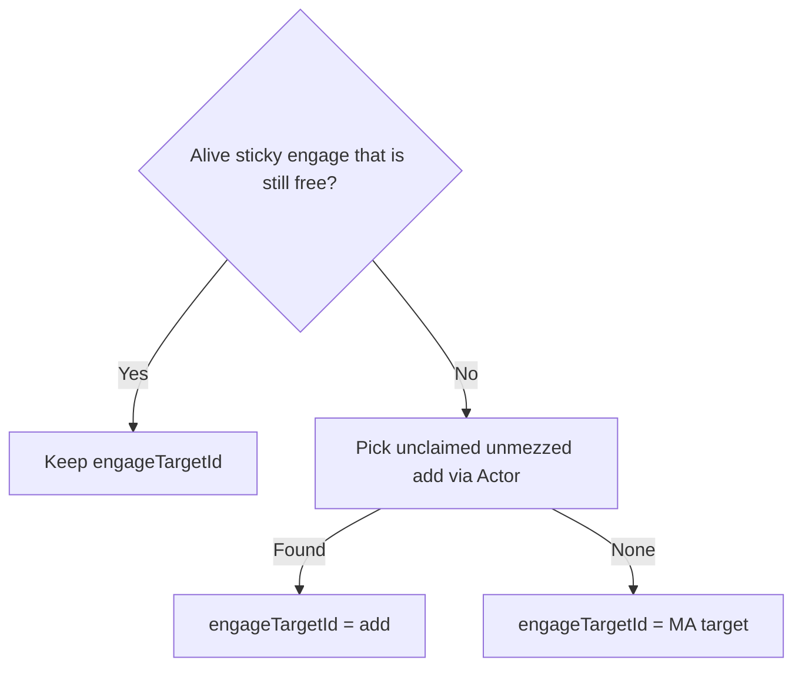

# Offtank Configuration

This document explains how to configure a bot as an **offtank**: claiming a free unmezzed add when one exists, or assisting the MA when every camp mob is already taken by MA/MT (or other offtanks). For MT/MA/Puller roles, see [Tank and Assist Roles](tank-and-assist-roles.md).

## Overview

- **AssistName (MA)** must be set so the offtank knows whose target to assist when no free add remains.
- Offtanks **always prefer a free add**: an unmezzed MobList spawn that is not the MA target, not the MT target, not charm-skipped, and not claimed by another OT via the [CZBot Actor channel](czbot-actor-channel.md) (`ot_claim` / last-writer-wins).
- When **no free add** remains (e.g. one mob total, or MT on one and MA on another with nothing left), the offtank **assists the MA's target**.
- Once engaged on a free add, the offtank **sticks on that target until it dies or becomes mezzed/primary** (no `assistpct` gate). Mezzed engages are dropped so the OT can re-pick a free unmezzed add.
- **`onlyMT` debuffs** (e.g. Taunt with **When MT Only** checked) cast on the off-tank's current engage target while actively off-tanking — not on the main tank's mob.

---

## Config file reference

### Melee section (offtank)

| Option | Default | Purpose |
|--------|--------|---------|
| **offtank** | `false` | Set to `true` to make this bot an offtank. |

**AssistName** is under **`settings.AssistName`**. The offtank logic uses the MA's target; if AssistName is unset, the bot may treat the tank as assist (see [Tank and Assist Roles](tank-and-assist-roles.md)).

**Example**

```lua
['settings'] = {
  ['AssistName'] = "Mainassistname"
},
['melee'] = {
  ['offtank'] = true,
  ['stickcmd'] = 'hold uw 7',
  ['assistpct'] = 99
}
```

---

## Offtank decision


```mermaid
flowchart TD
    Sticky{Alive sticky engage that is still free?}
    Sticky -->|Yes| Keep[Keep engageTargetId]
    Sticky -->|No| PickAdd[Pick unclaimed unmezzed add via Actor]
    PickAdd -->|Found| Claim[engageTargetId = add]
    PickAdd -->|None| MaAssist[engageTargetId = MA target]
```

- **Free add:** Offtanks publish **`ot_claim`**; conflicts resolve **last-writer-wins** (newer timestamp keeps the add; loser re-picks or assists MA).
- **No free add:** Offtank **assists the MA's target** (engage target = MA target; bot uses stick/agro/taunt).

---

## Runtime control

- **Toggle offtank:** `/cz offtank on` or `/cz offtank off`, or `/cz offtank` to toggle.
- **Set MA:** `/cz assist set <name>` or `/cz assist automatic` (required for offtank behavior).
- **Diagnostics:** `/cz actor status` — OT claims and peer state.

---

## Scenarios

- **Offtank bot:** Set **offtank** to `true` (config or `/cz offtank on`) and set **AssistName** to the Main Assist. With three unmezzed camp mobs where MT and MA each hold one, this bot claims the third. With only MA/MT targets left (no free add), it assists the MA.
- For more role scenarios (human MA, bot MT, automatic mode), see [Tank and Assist Roles — Scenarios](tank-and-assist-roles.md#scenarios-plain-english).
