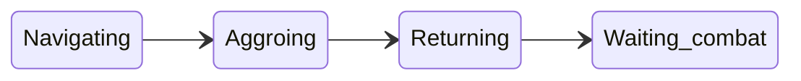

# Pull Configuration and Logic

This document explains how to configure and control the bot’s **pulling** behavior: how the bot finds mobs, navigates to them, gets aggro, and returns to camp. It is intended for human operators who need to set up the config file and use runtime commands.

## Overview

When pulling is enabled, the bot can automatically find mobs within range of camp, navigate to them (using MQ2Nav), aggro them using the configured pull method, and return to camp so the group can engage.

- **Master switch:** Pulling only runs when **`settings.dopull`** is `true`. Default is `false`.
- **Where to configure:** In your config file, set **`settings.dopull`** under the `settings` section, and all pull options under the **`pull`** section. See [Config file reference](#config-file-reference) below.

---

## Config file reference

### Settings

| Option | Default | Purpose |
|--------|--------|---------|
| **dopull** | `false` | Boolean. Enables or disables the pull loop. When `true`, the `pull` section is applied. |

### Pull section

All pull options live under **`config.pull`**. If a value is omitted, the default in the table below is used.

| Option | Default | Purpose |
|--------|--------|---------|
| **radius** | 400 | Max horizontal distance from camp (X,Y) for pullable mobs. |
| **zrange** | 150 | Max vertical (Z) difference from camp; mobs outside this are ignored. |
| **pullability** | `'melee'` | How to aggro: `melee`, `ranged`, `warp`, or a spell/disc/ability name (e.g. a spell gem name, discipline, or alt ability). |
| **abilityrange** | 60 | Distance at which the pull ability is used; the bot navigates to within this range before using the pull. |
| **minlevel** / **maxlevel** | 0 / 200 | Only mobs with level in this range are considered for pulling. |
| **chainpullcnt** | 0 | Allow chain-pulling when current mob count is ≤ this value. See [When does the bot start a pull?](#when-does-the-bot-start-a-pull). |
| **chainpullhp** | 0 | When the current engage target’s HP % is ≤ this (and chain conditions are met), the bot may start the next pull. |
| **mana** | 60 | Minimum mana % required for designated healer classes before a new pull is allowed. |
| **manaclass** | `'clr, dru, shm'` | Comma-separated class short names (e.g. clr, dru, shm) that are checked for **mana** before allowing a pull. |
| **leash** | 500 | While returning to camp with a mob, navigation is paused if the mob is farther than this distance (avoids over-chasing). |
| **usepriority** | `false` | If `true`, prefer mobs that match the runtime **Priority** list over path distance when choosing a pull target. |
| **hunter** | `false` | Hunter mode: no makecamp; anchor is set once. The puller can be far from camp. See [Hunter mode vs camp mode](#hunter-mode-vs-camp-mode). |

**Note:** **pullarc** (directional pulling) is not in the config file; it is set at runtime with **`/cz xarc <degrees>`**. See [Runtime control](#runtime-control-commands).

---

## When does the bot start a pull?

The bot does **not** start a new pull while it is already in a pull (navigating, aggroing, returning, or waiting for combat). In that case it only runs the pull state machine until the current pull finishes.

When the bot is **not** already pulling, **StartPull()** is called when **any** of the following is true:

1. **Idle:** Mob count is 0 and there is no current engage target → start a pull.
2. **Chain (count):** Current mob count is **less than** `chainpullcnt` → start a pull (e.g. keep pulling until you have at least `chainpullcnt` mobs).
3. **Chain (HP):** Current mob count is ≤ `chainpullcnt` **and** the current engage target’s HP % is ≤ `chainpullhp` → start the next pull (e.g. pull the next mob when the current one is low).

In all cases, the internal **pre-conditions** must also pass (see [Pre-conditions that block pulling](#pre-conditions-that-block-pulling)). If they do not, no pull is started even when one of the three conditions above is true.

---

## Pull state flow

Once a pull has started, the bot moves through these phases:

1. **Navigating** — Paths to the chosen mob. May abort on timeout, low HP, or if the bot leaves camp (e.g. beyond radius + 40).
2. **Aggroing** — When in range, uses **pullability** (melee, ranged, spell, disc, alt ability, or warp) to get aggro.
3. **Returning** — Navigates back to camp with the mob. Leash logic may pause nav if the mob is too far.
4. **Waiting_combat** — Mob is in camp; normal melee/combat runs until the mob is dead or timers clear the pull state.

---

## Pre-conditions that block pulling

Even when one of the “start a pull” conditions is true, the bot will **not** start a pull if any of the following apply:

- **MasterPause** — Global pause is on; pull is skipped.
- **No MQ2Nav mesh** — No navigation mesh is loaded. Pull is skipped and **dopull** is turned off with an in-game message. Generate a mesh before using pulling.
- **Your HP ≤ 45%** — No new pull is started; an in-progress pull may also abort.
- **Group mana** — If any group member’s class is in **manaclass** and their mana % is below **mana**, no new pull.
- **Group corpse** — Any group member is dead (corpse); no new pull.
- **Return timer** — After pulling a mob, a short return timer blocks starting another pull until the previous pull’s mob is cleared (e.g. dead or out of range) or the timer expires.

---

## Hunter mode vs camp mode

- **Camp mode** (`hunter` false): MakeCamp is used; the puller returns to a fixed camp. If the puller is more than 200 distance from camp when the pull target is already engaged by someone else, the engage check can abort and the bot returns to camp.
- **Hunter mode** (`hunter` true): No makecamp; the anchor is set once (e.g. when you first enable pulling). The puller can be far from camp without triggering the 200-distance engage abort. Useful for a roaming puller.

---

## Runtime control (commands)

- **Toggle pulling:** `/cz dopull on` or `/cz dopull off`. You can also toggle without arguments (e.g. `/cz dopull`). Turning **off** clears target, stops nav/stick/attack; if **hunter** is true, it also clears the makecamp anchor.
- **Directional pulling:** `/cz xarc <degrees>` — Restrict pulls to an arc in front of the bot (e.g. `90` for a 90° cone). Use with no argument to turn directional pulling off.
- **Exclude / priority:** **ExcludeList** and **PriorityList** are **runtime** (runconfig), not in the pull config file. Use **`/cz exclude <name>`** to add a mob to the exclude list (pull target selection will skip it). Use **`/cz priority <name>`** to add a mob to the priority list; when **pull.usepriority** is `true`, the bot prefers priority mobs over path distance. You can target a mob and use `/cz exclude` or `/cz priority` without a name to use the target’s name.

---

## Relation to Group.Puller

- **No gating:** The bot does **not** check whether this character is the **Group.Puller**. Any character with **dopull** `true` will run the pull loop. You can have multiple pullers or a single designated puller; the config does not restrict who pulls.
- **MT target preference:** When this bot is the **Main Tank** (and TankName is set to `"automatic"`), the bot uses **Group.Puller** only to **prefer the Puller’s current target** when choosing which mob from the camp list to engage. So: the puller brings a mob to camp → the MT picks a target and prefers that mob. For how to set up MT, MA, and Puller, see [Tank and Assist Roles](tank-and-assist-roles.md).

---

## FTE / already engaged

If the bot sees that the pull target is already engaged by someone else (another player or pet), it abandons the pull and returns to camp. That target may be temporarily excluded from pull selection (FTE list) so the bot does not immediately try to pull it again.

---

## Pull target selection

The bot builds a list of candidate mobs that:

- Are NPCs.
- Are within **radius** (2D) and **zrange** (Z) of camp.
- Are within **minlevel** and **maxlevel**.
- Have a valid navigation path (MQ2Nav).
- Are not in the runtime **ExcludeList**.
- Are not on the FTE (first-to-engage) list.
- If **pullarc** is set, lie within the chosen arc in front of the bot.

From that list, the bot picks one target:

- If **usepriority** is `true` and **PriorityList** is set, it prefers the first mob whose name matches the priority list.
- Otherwise it chooses the **closest by path length** (shortest nav path to camp).
