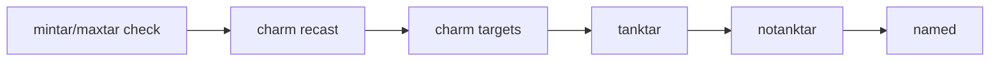

# Spell targeting and bands

This page explains **how** spell targeting works for all spell types (heal, buff, debuff, cure) and how band tags interact: evaluation order, count gates like **mintar**/**maxtar** (debuff), and combining tags. Healing and debuffing have the most complex logic and are covered in the most detail; buff and cure are covered fully but in proportion. Section-specific docs ([Healing configuration](healing-configuration.md), [Buffing configuration](buffing-configuration.md), [Debuffing configuration](debuffing-configuration.md), [Curing configuration](curing-configuration.md)) list the actual band tokens and config examples.

## Summary

| Section  | What "target" means | Count gate | Bands (main idea) |
| -------- | ------------------- | ---------- | ----------------- |
| **heal** | PCs, pets, corpses, group, XTargets | **tarcnt** = min group members in HP band for group/AE heals | **targetphase** (phase stages) + **validtargets** (within-phase types) + min/max HP % |
| **buff** | Self, tank, group AE, group members, peers by class, mypet, other pets | **tarcnt** for **groupbuff** (min group members needing buff) | **targetphase** + **validtargets** (classes or all); **cbt** / **idle** control when spell can run |
| **debuff** | Mobs in camp (MA target + adds) | **tarcnt** = min mobs in camp to consider spell | **targetphase** only (tanktar, notanktar, named) + min/max HP % |
| **cure**  | Self, tank, group AE cure, group members, peers by class | **tarcnt** for **groupcure** (min group members with detrimental) | **targetphase** + **validtargets**; **priority** in targetphase runs an earlier pass when any cure spell has it (no top-level setting). **groupmember**, **groupcure**, **pc** |

---

## How spell casting runs

For heal, buff, debuff, and cure, the bot uses the same pattern. It evaluates **phases** in a fixed order (each section has its own phase list below). For each phase, the bot gets the list of **targets** for that phase. For **each target**, it then checks **all spells** that have that phase in their bands (in config order). The **first** spell that the target needs is cast. Typically one cast per tick; the loop resumes (or the bot is busy until the cast finishes). So spell choice is driven by phase order first, then by which spell in that phase first matches the target—not by walking spell-by-spell and picking the first target.

---

## Heal targeting

Heal spells use the phase-first pattern above. The **phase order** is the evaluation order. For each phase, the bot gets the list of targets for that phase (e.g. self, tank, group members, peers), then for **each target** checks **all** heal spells that have that phase in their bands (in config order). The first spell that the target needs (HP in band, in range) is cast. Bands define **who** can receive the spell and **at what HP %**.

### Phase order

The heal phase order is:

1. **corpse** (rez) — Corpses in range; subject to rezoffset and **validtargets** for corpse (`all`, `bots`, `raid`); **cbt** in targetphase allows rez in combat.
2. **self** — Yourself.
3. **groupheal** (group/AE) — Group heal; requires enough group members in the spell’s HP band and in AE range (see **tarcnt** below).
4. **tank** — The resolved Main Tank (see [Tank and Assist Roles](tank-and-assist-roles.md)).
5. **groupmember** — Only characters in the bot’s (EQ) group (evaluated before pc).
6. **pc** — All peers (in or out of group). **validtargets** (classes or `all`) filter which classes.
7. **mypet** — Your pet.
8. **pet** — Other peers’ pets.
9. **xtgt** — Extended target (XTarget) slots when **heal.xttargets** is set.

For a given target, the first heal spell (in config order) that has that phase in its bands and for which the target is in HP band and in range is the one cast.

### tarcnt (heal)

**tarcnt** is only used for **groupheal** (group/AE heals). It is the minimum number of **group members** that must be in the spell’s HP band (and in AE range) for the spell to fire. When omitted, the group heal fires when at least one member is in band. **tarcnt** is not used for single-target heals.

### Bands

Each band has **targetphase** (phase tokens: corpse, self, groupheal, tank, pc, groupmember, mypet, pet, xtgt; optionally cbt) and **validtargets** (within-phase types: classes or `all` for pc/groupmember; `all`, `bots`, or `raid` for corpse). **groupmember** restricts single-target heals to characters in the bot’s group; **pc** allows any peer in range. Tank and self need no validtargets. Special tokens are described in [Healing configuration](healing-configuration.md).

---

## Debuff targeting

Debuff spells (including nukes and mez) target **mobs in the camp list**. A camp-size gate (**mintar** / **maxtar** in bands) and a fixed **evaluation order** determine when and which mob is chosen.

### Mob list

The bot builds a list of valid mobs (within camp leash and filters). This list is the **camp list**: the MA’s (or tank’s) current target plus all adds. Debuffs are only cast on mobs in this list. The number of mobs in the list is **MobCount**.

### mintar / maxtar (debuff — camp-size gate)

**mintar** and **maxtar** are optional band fields. They are checked at the **start** of debuff evaluation for that spell. **mintar = X, maxtar = nil** — only consider this spell when camp mob count ≥ X. **mintar = nil, maxtar = X** — effective minimum is 1; only consider when 1 ≤ mob count ≤ X. **mintar = X, maxtar = Y** — only consider when X ≤ mob count ≤ Y. If the current **MobCount** is outside the spell's effective range, the spell is **not considered at all** this tick — no target is chosen. See [Debuffing configuration](debuffing-configuration.md) for full details and the notanktar-only default.

### Evaluation order

For each debuff spell, the bot tries the following in order; the **first** valid target wins:

1. **Charm recast** — If charm broke and a recast was requested for this spell.
2. **Charm targets** — If **charmnames** is set, mobs in that list (for charm).
3. **tanktar** — The MA’s current target. Only tried if the spell’s bands include **tanktar**.
4. **notanktar** — Any other mob in the camp list (adds). Only tried if bands include **notanktar**.
5. **named** — Named mob that is the tank target. Only tried if bands include **named**.

### Band tags and combining them

- **tanktar** — The MA’s (or tank’s) current target.
- **notanktar** — Any other mob in the list (adds).
- **named** — Named mob; with tanktar, only the tank target when it is named.

A spell can have **multiple** valid target types (e.g. both **tanktar** and **notanktar**). Because **tanktar** is tried before **notanktar**, the tank’s target is chosen when it qualifies; otherwise an add can be chosen. So the same spell can fire on the tank’s target in one tick and on an add in another. If only **notanktar** is in bands, only adds are ever chosen.

### HP band

Each band’s **min** / **max** define mob HP %. For debuff, all bands for that spell are merged into one effective HP range per spell (see `applyBands` in the code). The mob’s HP must be in that range to be considered.

---

## Buff targeting

Buff spells choose a target in a fixed order. Bands use **targetphase** (priority stages) and **validtargets** (classes or `all`). **cbt** and **idle** in targetphase control **when** the spell can run (combat vs no mobs in camp), not who is targeted.

### Evaluation order

From `BuffEval` in the code, the order is:

1. **self** — Yourself (including **petspell** when you have no pet, for summon).
2. **byname** — Specific characters whose names appear in **validtargets** when **byname** is in targetphase.
3. **tank** — Main Tank (can be non-bot when explicitly named; only out-of-group non-bot we buff). Non-peer buff state from Spawn after targeting (BuffsPopulated).
4. **groupbuff** — Group AE buff; spell targets group; cast when enough group members need the buff (**tarcnt**). Need is from charinfo for peers, Spawn (when BuffsPopulated) for non-peers.
5. **groupmember** — In-group only (single-target); includes non-bot group members. Non-peer need from Spawn (BuffsPopulated).
6. **pc** — All peers by class (from validtargets). Not limited to group. Config token **bots** is accepted and treated as **pc**.
7. **mypet** — Your pet.
8. **pet** — Other peers’ pets.

For **BRD**, only **self** is tried after the initial self check (no tank/groupbuff/groupmember/pc/mypet/pet pass). See [Bard configuration](bard-configuration.md).

### Bands

Bands use **targetphase** and **validtargets**. targetphase tokens: **self**, **tank**, **groupbuff**, **groupmember**, **pc**, **mypet**, **pet**, **byname**, **cbt**, **idle**. validtargets: class shorts or **all** (for **groupmember** and **pc**); or character names (for **byname**). **cbt** / **idle** = when the spell can run. **tarcnt** optional for **groupbuff**. See [Buffing configuration](buffing-configuration.md) for the full list and examples.

---

## Cure targeting

Cure spells use the same phase-first, per-target spell-check as heal and buff. The **phase order** for the main cure pass is: self → tank → groupcure → groupmember → pc. For each phase, the bot gets the list of targets for that phase, then for **each target** checks **all** cure spells that have that phase in their bands (in config order). The first spell that the target needs (matching detrimental, in range) is cast. Bands use **targetphase** and **validtargets**. **groupmember** = in-group only (peers then non-peer group members via Group TLO). **groupcure** = group AE cure. **pc** = all peers.

### Priority cure pass

When **at least one cure spell has priority in its band targetphase**, an earlier hook runs (before heals and before the main cure hook). That hook **only considers those spells**. Those spells are evaluated in the same target order (self, tank, groupcure, groupmember, pc). No top-level setting is required. After casting a cure in the main pass, the bot may re-evaluate so multiple cures can fire in sequence.

### Phase order (main pass)

1. **self** — Yourself (if bands allow).
2. **tank** — Main Tank (if bands allow; can be non-bot when explicitly named; only out-of-group non-bot we cure). Non-peer detrimentals from Spawn after targeting (BuffsPopulated).
3. **groupcure** — Group AE cure; spell targets group; cast when at least **tarcnt** group members have a matching detrimental (peers from charinfo, non-peers from Spawn when BuffsPopulated).
4. **groupmember** — In-group only: peers first, then non-peer group members. Non-peer need from Spawn (BuffsPopulated).
5. **pc** — All peers by class from validtargets (no group check). Out-of-group peers can be cured in this pass.

See [Curing configuration](curing-configuration.md) and [Out-of-group peers](out-of-group-peers.md).

### Bands

Bands use **targetphase** and **validtargets** (no min/max). **targetphase** tokens: **self**, **tank**, **groupcure**, **groupmember**, **pc**, and **priority**. When any cure spell has **priority** in targetphase, the priority cure pass runs (earlier hook); no separate configuration is needed. **validtargets**: class shorts or **all**. **tarcnt** optional for **groupcure**. **curetype** (e.g. poison, disease, curse, corruption, all) determines when the spell is considered; targeting is by bands and the phase order above.

---

## See also

- [Healing configuration](healing-configuration.md) — Heal bands, rez, interrupt, XT targets.
- [Buffing configuration](buffing-configuration.md) — Buff bands, spellicon, combat vs idle.
- [Debuffing configuration](debuffing-configuration.md) — Debuff bands, charmnames, recast, delay.
- [Curing configuration](curing-configuration.md) — Cure bands, curetype, priority phase.
- [Nuking configuration](nuking-configuration.md) — Nukes as debuffs (tanktar, notanktar).
- [Mezzing configuration](mezzing-configuration.md) — Mez as debuffs (notanktar, charmnames).
- [Out-of-group peers](out-of-group-peers.md) — How peers outside your group are treated for heals, buffs, cures.
