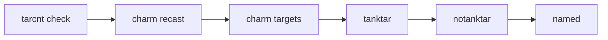

# Spell targeting and bands

This page explains **how** spell targeting works for all spell types (heal, buff, debuff, cure) and how band tags interact: evaluation order, count gates like **tarcnt**, and combining tags. Healing and debuffing have the most complex logic and are covered in the most detail; buff and cure are covered fully but in proportion. Section-specific docs ([Healing configuration](healing-configuration.md), [Buffing configuration](buffing-configuration.md), [Debuffing configuration](debuffing-configuration.md), [Curing configuration](curing-configuration.md)) list the actual band tokens and config examples.

## Summary

| Section  | What "target" means | Count gate | Bands (main idea) |
| -------- | ------------------- | ---------- | ----------------- |
| **heal** | PCs, pets, corpses, group, XTargets | **tarcnt** = min group members in HP band for group/AE heals | class + min/max HP % |
| **buff** | Self, tank, peers by class, mypet, other pets | None | class only; **cbt** / **idle** control when spell can run |
| **debuff** | Mobs in camp (MA target + adds) | **tarcnt** = min mobs in camp to consider spell | tanktar / notanktar / named + min/max HP % |
| **cure**  | Self, tank, peers by class | None | class only; **group** = two-pass (in-group then all peers) |

---

## Heal targeting

Heal spells choose a target by walking a fixed **evaluation order**; the first valid target in range gets the heal. Bands define **who** can receive the spell and **at what HP %**.

### Evaluation order

From `HPEval` in the code, the order is:

1. **corpse** (rez) — Corpses in range; subject to rezoffset and band (e.g. **bots**, **raid**, **cbt**, **all**).
2. **self** — Yourself.
3. **grp** (group/AE) — Group heal; requires enough group members in the spell’s HP band and in AE range (see **tarcnt** below).
4. **tank** — The resolved Main Tank (see [Tank and Assist Roles](tank-and-assist-roles.md)).
5. **pc** (by class) — Other PCs (peers). If **group** is in the spell’s bands, only peers who are in the bot’s group are considered; otherwise any peer in range whose HP is in the band.
6. **mypet** — Your pet.
7. **pet** — Other peers’ pets.
8. **xtgt** — Extended target (XTarget) slots when **heal.xttargets** is set.

The first matching target in range wins.

### tarcnt (heal)

**tarcnt** is only used for **group/AE heals**. It is the minimum number of **group members** that must be in the spell’s HP band (and in AE range) for the spell to fire. The code checks `grpmatch >= (entry.tarcnt or 1)`. When omitted, the group heal fires when at least one member is in band. **tarcnt** is not used for single-target heals.

### Bands

Each band has **class** (who) and **min** / **max** (HP %). Heal band tokens include: **pc**, **tank**, **grp**, **self**, **corpse**, **bots**, **raid**, **mypet**, **pet**, **xtgt**, **group**, **cbt**, **all**, and class shorts. **group** restricts single-target PC and tank heals to peers in the bot’s group; omitting it allows any peer in range. Special tokens (e.g. **cbt** for rez during combat, **xtgt** for extended targets) are described in [Healing configuration](healing-configuration.md).

---

## Debuff targeting

Debuff spells (including nukes and mez) target **mobs in the camp list**. A camp-size gate (**tarcnt**) and a fixed **evaluation order** determine when and which mob is chosen.

### Mob list

The bot builds a list of valid mobs (within camp leash and filters). This list is the **camp list**: the MA’s (or tank’s) current target plus all adds. Debuffs are only cast on mobs in this list. The number of mobs in the list is **MobCount**.

### tarcnt (debuff — camp-size gate)

**tarcnt** is checked at the **start** of debuff evaluation for that spell. If `entry.tarcnt > MobCount`, the spell is **not considered at all** this tick — no target is chosen. So **tarcnt** means: “Only consider this spell when there are at least N mobs in camp.” For example, **tarcnt 2** = at least two mobs (MA target + one add).

### Evaluation order

For each debuff spell, the bot tries the following in order; the **first** valid target wins:

1. **Charm recast** — If charm broke and a recast was requested for this spell.
2. **Charm targets** — If **charmnames** is set, mobs in that list (for charm).
3. **tanktar** — The MA’s current target. Only tried if the spell’s bands include **tanktar**.
4. **notanktar** — Any other mob in the camp list (adds). Only tried if bands include **notanktar**.
5. **named** — Named mob that is the tank target. Only tried if bands include **named**.

### Band tags and combining them

- **tanktar** — The MA’s (or tank’s) current target.
- **notanktar** — Any other mob in the list (adds).
- **named** — Named mob; with tanktar, only the tank target when it is named.

A spell can have **multiple** band classes (e.g. both **tanktar** and **notanktar**). Because **tanktar** is tried before **notanktar**, the tank’s target is chosen when it qualifies; otherwise an add can be chosen. So the same spell can fire on the tank’s target in one tick and on an add in another. If only **notanktar** is in bands, only adds are ever chosen.

### HP band

Each band’s **min** / **max** define mob HP %. For debuff, all bands for that spell are merged into one effective HP range per spell (see `applyBands` in the code). The mob’s HP must be in that range to be considered.

---

## Buff targeting

Buff spells choose a target in a fixed order. Bands use **class** only (no min/max). **cbt** and **idle** in bands control **when** the spell is allowed to run (combat vs no mobs in camp), not who is targeted.

### Evaluation order

From `BuffEval` in the code, the order is:

1. **self** — Yourself (including **petspell** when you have no pet, for summon).
2. **byname** — Specific characters whose names appear in the band’s class list.
3. **tank** — Main Tank.
4. **bots** — Other peers by class (from bands). “Bots” = all peers (charinfo), not limited to group.
5. **mypet** — Your pet.
6. **pet** — Other peers’ pets.

For **BRD**, only **self** is tried after the initial self check (no tank/bots/mypet/pet pass).

### Bands

Bands use **class** only (no min/max). Tokens include: **self**, **petspell**, **tank**, **mypet**, **pet**, class shorts, **name**, **cbt**, **idle**. **cbt** = this buff can run when there are mobs in camp; **idle** = can run when there are no mobs. If neither is set, the spell can run in either case. There is no **tarcnt** for buffs. See [Buffing configuration](buffing-configuration.md) for the full list and examples.

---

## Cure targeting

Cure spells choose a target in a fixed order. Bands use **class** only. **group** in bands enables a **two-pass** behavior: first in-group peers, then all peers.

### Evaluation order

From `CureEval` in the code, the order is:

1. **self** — Yourself (if bands allow).
2. **tank** — Main Tank (if bands allow).
3. **group** pass — Only peers who are **in the bot’s group**, by class from bands. Each such peer is checked for needing the cure.
4. **all peers** pass — **All** peers by class from bands (no group check). This allows curing out-of-group peers in this second pass.

So **group** in bands does not restrict cures to group only; it adds a first pass over in-group peers, then a second pass over all peers. See [Curing configuration](curing-configuration.md) and [Out-of-group peers](out-of-group-peers.md).

### Bands

Bands use **class** only (no min/max). Tokens: **self**, **tank**, **group**, and class shorts. There is no **tarcnt** for cures. **curetype** (e.g. poison, disease, curse, corruption, all) determines when the spell is considered; targeting is by bands and the order above.

---

## See also

- [Healing configuration](healing-configuration.md) — Heal bands, rez, interrupt, XT targets.
- [Buffing configuration](buffing-configuration.md) — Buff bands, spellicon, combat vs idle.
- [Debuffing configuration](debuffing-configuration.md) — Debuff bands, charmnames, recast, delay.
- [Curing configuration](curing-configuration.md) — Cure bands, curetype, prioritycure.
- [Nuking configuration](nuking-configuration.md) — Nukes as debuffs (tanktar, notanktar).
- [Mezzing configuration](mezzing-configuration.md) — Mez as debuffs (notanktar, charmnames).
- [Out-of-group peers](out-of-group-peers.md) — How peers outside your group are treated for heals, buffs, cures.
