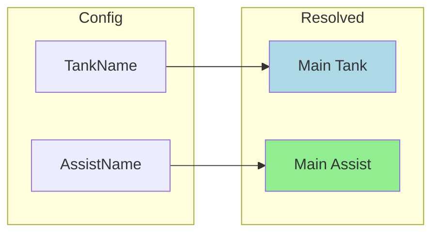
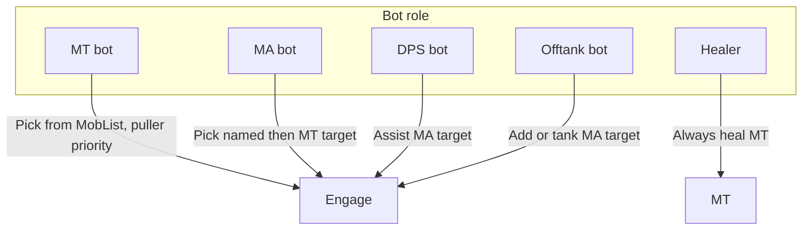
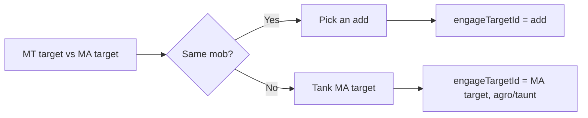

# Tank and Assist Roles

This document explains how to configure **Main Tank (MT)**, **Main Assist (MA)**, and **Puller**, and how each bot behaves in different scenarios.

## Overview

- **Main Tank (MT)**  
  The character who receives **heals** (healers prioritize this person) and who is allowed to **pick from the mob list** to start engagements when that character is a bot. Only the MT bot chooses which mob to engage from the camp list (with puller priority).

- **Main Assist (MA)**  
  The character whose **target** all DPS and offtank follow. When you say “assist,” bots attack whatever the MA has targeted. The `/attack` command engages the MA’s target.

- **Puller**  
  Set in the game (group window). When the MT is a bot and TankName is set to `"automatic"`, the MT bot prefers the **Puller’s target** when choosing which mob to engage from the camp list (e.g. the mob the puller is bringing in).

Heals always go to the MT. DPS and offtank behavior follow the MA (or the MA’s target). When MT and MA are different, the offtank logic depends on whether they are on the same mob or not (see Offtank below).

---

## How to Configure

### TankName (Main Tank)

- **Where:** Config file under `settings.TankName`, or at runtime with `/cz tank <name>` or `/cz tank automatic`.
- **Values:**
  - **Character name** — e.g. `Warriorname`. This character is the Main Tank; healers focus on them, and if this bot is that character, it picks from the mob list.
  - **`"manual"`** — No default MT; set at runtime with `/cz tank SomeName`.
  - **`"automatic"`** — Use the **group’s Main Tank** role (from the group window). In raids, Main Tank still comes from the **group** (raid has no Main Tank role).

Healers always use the resolved MT. Only the character who is the MT (when a bot) picks from the mob list and uses puller priority.

### AssistName (Main Assist)

- **Where:** Config file under `settings.AssistName`, or at runtime with `/cz assist <name>` or `/cz assist automatic`.
- **Values:**
  - **Character name** — This character is the Main Assist; DPS and offtank follow their target. `/attack` engages the MA’s target.
  - **`"manual"`** — No default MA; set at runtime with `/cz assist SomeName`.
  - **`"automatic"`** — Use **raid Main Assist** when in a raid, otherwise **group Main Assist**.

If you do **not** set AssistName (leave it unset or empty), the bot treats it as the same as TankName so that “everyone assists the tank” (backward compatible).

### Puller

- **Where:** Set in the **game group window** (right‑click group member, assign Puller). There is no bot config for the puller.
- **Effect:** When TankName is `"automatic"` and this bot is the MT, it prefers the Puller’s current target when choosing which mob to engage from the camp list.

---

## Config and Roles (Mermaid)

When **automatic**:

- **MT** = Group.MainTank (raid has no Main Tank; always from group).
- **MA** = Raid.MainAssist when in raid, else Group.MainAssist.
- **Puller** = Group.Puller (raid has no Puller; always from group).

---

## Who Does What (Mermaid)

- **MT bot:** Picks which mob to engage from the mob list (closest LOS, puller’s target preferred when applicable).
- **MA bot:** Chooses its own target: **named** mobs first, then **MT’s target**.
- **DPS bot:** Syncs to the MA’s target (assists the MA).
- **Offtank bot:** See next diagram.
- **Healer:** Always prioritizes the MT (no MA in heal logic).

---

## Offtank Decision (Mermaid)

- **MT target == MA target (same mob):** Offtank picks an **add** (Nth other mob in the list, via `otoffset`).
- **MT target != MA target (different mobs):** Offtank **tanks the MA’s target** (sets engage target to MA’s target and uses agro/taunt).

---

## Scenarios (Plain English)

### All bots assist the same person (legacy)

- Set **TankName** to that character’s name.
- Leave **AssistName** unset (or set it to the same as TankName).
- Everyone assists the tank; heals go to the tank. Behavior matches the old “single tank” setup.

### Human is Main Assist

- Set **TankName** to the MT (can be a bot or human).
- Set **AssistName** to the human’s name.
- All bots assist the human’s target; heals go to the MT. The human directs which mob the group DPSes (e.g. event logic: kill adds first, keep one mob tanked). No special MA-bot logic runs.

### Bot is Main Tank

- Set **TankName** to this bot’s name (or use `"automatic"` and assign this bot as group MT in the group window).
- This bot picks from the mob list and prefers the **Puller’s target** when the camp list is used and a puller is set.

### Bot is Main Assist (different from MT)

- Set **AssistName** to this bot’s name (or `"automatic"` and assign this bot as group/raid MA).
- This bot chooses its own target: **named** mobs first, then **MT’s target**. Other DPS and offtank follow this bot’s target.

### Offtank bot

- Set **offtank** to true (config or `/cz offtank on`) and set **AssistName** (MA).
- If MT and MA are on the **same** mob, offtank picks an **add** (Nth other mob).
- If MT and MA are on **different** mobs, offtank **tanks the MA’s target** (agro/taunt).

### Automatic mode

- Set **TankName** and/or **AssistName** to **`"automatic"`**.
- The bot uses the **group** (or **raid** for MA) window roles:
  - **MT** = Group.MainTank
  - **MA** = Raid.MainAssist when in raid, else Group.MainAssist
  - **Puller** = Group.Puller (group only; raid has no Puller)

Raid has no Main Tank or Puller in the game UI, so those always come from the group.
